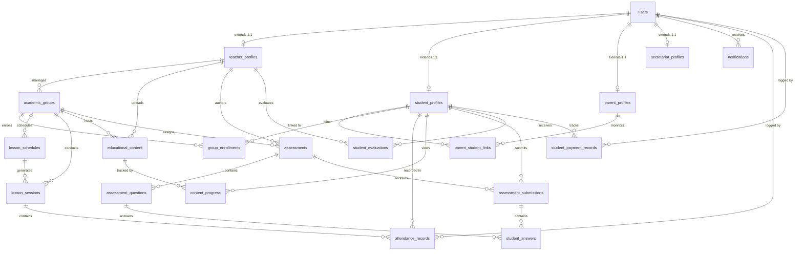

# Database Design Specification

## 1. Document Overview

### 1.1 Purpose
This document defines the conceptual and logical database architecture for the **Educational Management System for Teachers and Students** (El Awal). It specifies the relational data structures, entity models, field definitions, referential integrity constraints, indexing strategies, and lifecycle behaviors required to satisfy the approved product requirements.

### 1.2 Scope
This specification covers the persistent data requirements for all nine approved product modules:
1. Student Management
2. Attendance & Absence
3. Lectures & Lessons
4. Exams & Assignments
5. Parent Student Status
6. Notifications
7. Groups Management
8. Users & Permissions
9. Subscriptions (Student Payment Status)

This document is strictly a **database design specification**. It contains no application source code, ORM code, migration scripts, or SQL implementation scripts.

### 1.3 Audience
- **Database Architects & Backend Engineers**: Responsible for evaluating data structures, relationships, and integrity rules.
- **ORM & Schema Implementers**: Responsible for translating this logical blueprint into ORM schema declarations (e.g., Prisma Schema) and database migrations.
- **QA Engineers**: Responsible for verifying that data constraints, relationships, and persistence logic match test cases.

### 1.4 Source Documents
- [Product Requirements Document (PRD)](file:///d:/el_awal/docs/01-PRD/product-requirements.md)
- [Business Requirements Document](file:///d:/el_awal/docs/01-PRD/business-requirements.md)
- [Functional Requirements Document](file:///d:/el_awal/docs/01-PRD/functional-requirements.md)
- [Data Layer Architecture](file:///d:/el_awal/docs/03-Architecture/data-layer.md)
- [Business Logic Architecture](file:///d:/el_awal/docs/03-Architecture/business-logic.md)

---

## 2. Database Design Principles

1. **Normalization & Minimal Redundancy**: Relational normalization (3NF baseline) is applied to eliminate redundant data storage. Derived values (e.g., total attendance counts, average scores) are computed dynamically rather than duplicated in persistent storage.
2. **Referential Integrity & Constraints**: Database-level foreign keys, unique composite indexes, and check constraints enforce domain business rules directly within the database engine.
3. **Explicit Identity vs. Domain Profile Separation**: General user authentication identity is decoupled from domain-specific role profiles (`TeacherProfile`, `StudentProfile`, `ParentProfile`, `SecretariatProfile`), preventing schema pollution across user roles.
4. **Historical Record Preservation**: Session-level attendance, assessment submissions, and student evaluation logs are protected against cascading deletion to preserve immutable academic history.
5. **Decoupled Binary Storage**: Large binary assets (PDF summaries, documents, lecture video recordings) are persisted in external object storage; the database stores strictly structured metadata, storage keys, MIME types, and URI references.
6. **Predictable Scalability**: Entity keys utilize universally unique identifiers (UUIDv4), and high-frequency query paths utilize targeted composite B-tree indexes.

---

## 3. Technology Context

### 3.1 PostgreSQL
The logical design is optimized for PostgreSQL capabilities:
- **Identifier Strategy**: 128-bit UUID primary keys for distributed generation and security against sequential enumeration.
- **Temporal Data**: `TIMESTAMP WITH TIME ZONE` (`TIMESTAMPTZ`) for global timestamp accuracy across sessions, submissions, and audit events; `DATE` and `TIME` types for calendar sessions and recurring schedules.
- **Domain Enumerations**: Relational enum types for bounded business states (e.g., User Roles, Attendance Statuses, Assessment Types, Question Types, Submission Statuses, Notification Types).
- **Structured Semi-Structured Data**: `JSONB` data types for flexible assessment question options without requiring artificial one-to-many option tables for simple multiple-choice questions.

### 3.2 Neon Database Platform
The design assumes deployment on Neon serverless PostgreSQL:
- **Branching Architecture**: Relational schema definitions are designed to support branching workflows across development, preview, and production environments.
- **Connection Management**: Connection patterns rely on stateless, transaction-safe query execution compatible with Neon connection pooling.

### 3.3 ORM Alignment (Prisma Mapping Readiness)
The logical schema uses standard relational concepts that map cleanly to modern ORMs (specifically Prisma) upon implementation:
- Pure relational models with 1:1, 1:N, and N:M junction structures.
- Explicit composite unique constraints representing business exclusivity.
- Clear foreign key naming (`<entity>_id`) and relational cardinalities.

---

## 4. Domain & Module Mapping

| Product Module | Required Logical Entities | Primary Purpose | Related Functional Requirements |
|---|---|---|---|
| **1. Student Management** | `StudentProfile`, `ParentStudentLink` | Stores student demographic profiles, academic status, and parent linkages. | `FR-STU-001..004` |
| **2. Attendance & Absence** | `LessonSession`, `AttendanceRecord` | Captures scheduled class instances and student-level presence/absence records. | `FR-ATT-001..003` |
| **3. Lectures & Lessons** | `EducationalContent`, `ContentProgress` | Manages file/video metadata and tracks individual student viewing activity. | `FR-LES-001..003` |
| **4. Exams & Assignments** | `Assessment`, `AssessmentQuestion`, `AssessmentSubmission`, `StudentAnswer` | Manages assignment and exam lifecycles, student submissions, and auto-grading data. | `FR-EXM-001..007` |
| **5. Parent Student Status** | `StudentEvaluation` | Stores teacher notes, qualitative feedback, and student academic evaluations for parents. | `FR-PAR-001..005` |
| **6. Notifications** | `Notification` | Persists event-triggered alerts for lessons, homework, exams, grades, and absences. | `FR-NOT-001..005` |
| **7. Groups Management** | `AcademicGroup`, `GroupEnrollment`, `LessonSchedule` | Organizes student cohorts, recurring lesson schedules, and cohort rosters. | `FR-GRP-001..003` |
| **8. Users & Permissions** | `User`, `TeacherProfile`, `ParentProfile`, `SecretariatProfile` | Represents authenticated user identities and role-specific profile extensions. | `FR-USR-001..004` |
| **9. Subscriptions** | `StudentPaymentRecord` | Tracks student fee payment status records without payment gateway processing. | `FR-SUB-001` |

---

## 5. Entity Identification & Lifecycles

### 5.1 `User`
- **Purpose**: Central identity entity for authentication and system-wide account representation.
- **Related Requirements**: `FR-USR-001..004`, `PRD-009`.
- **Lifecycle**: Created during user onboarding/registration; updated when contact information changes; deactivated (`is_active = false`) upon offboarding; permanent deletion restricted to prevent orphaned audit trails.

### 5.2 `TeacherProfile`
- **Purpose**: Domain profile extension for educators managing groups, content, and grading.
- **Related Requirements**: `FR-USR-004`, `PRD-009`.
- **Lifecycle**: Created synchronously with `User` having role `TEACHER`; modified when specialty/bio updates; deletion cascades only if no active academic groups exist.

### 5.3 `StudentProfile`
- **Purpose**: Domain profile extension for learners tracking grade level and academic status.
- **Related Requirements**: `FR-STU-001`, `FR-STU-004`, `FR-USR-003`, `PRD-001`, `PRD-009`.
- **Lifecycle**: Created upon student enrollment; modified when grade level or status changes; soft-deactivated upon graduation or withdrawal; hard deletion restricted if attendance or grading records exist.

### 5.4 `ParentProfile`
- **Purpose**: Domain profile extension for guardians monitoring student academic standing.
- **Related Requirements**: `FR-STU-003`, `FR-USR-002`, `PRD-001`, `PRD-009`.
- **Lifecycle**: Created when guardian contact is registered; updated when contact numbers change; linked to students via `ParentStudentLink`.

### 5.5 `SecretariatProfile`
- **Purpose**: Domain profile extension for administrative operational staff.
- **Related Requirements**: `FR-USR-001`, `PRD-009`.
- **Lifecycle**: Created upon staff account provisioning; updated when staff titles change.

### 5.6 `ParentStudentLink`
- **Purpose**: Associative entity establishing guardian-student monitoring relationships.
- **Related Requirements**: `FR-STU-003`, `FR-PAR-001..005`, `PRD-001`, `PRD-007`.
- **Lifecycle**: Created upon parent-student linkage verification; deleted if guardianship association is severed.

### 5.7 `AcademicGroup`
- **Purpose**: Educational cohort/class entity created by an instructor or administrator.
- **Related Requirements**: `FR-GRP-003`, `FR-STU-002`, `PRD-002`.
- **Lifecycle**: Created by teacher/admin; updated when schedules or grade levels change; marked inactive (`is_active = false`) at end of academic term.

### 5.8 `GroupEnrollment`
- **Purpose**: Membership record associating a student with an educational group.
- **Related Requirements**: `FR-GRP-002`, `PRD-002`.
- **Lifecycle**: Created when a student is added to a group; status updated to "TRANSFERRED" or "DROPPED" if student leaves; historical record retained.

### 5.9 `LessonSchedule`
- **Purpose**: Recurring weekly timetable definition for an academic group.
- **Related Requirements**: `FR-GRP-001`, `PRD-002`.
- **Lifecycle**: Created during group setup; modified when class timing shifts; deleted or archived when schedule is revised.

### 5.10 `LessonSession`
- **Purpose**: Concrete calendar occurrence of a class session for attendance tracking.
- **Related Requirements**: `FR-ATT-001..003`, `PRD-003`.
- **Lifecycle**: Created automatically or manually prior to class; updated with topic notes; retained indefinitely for attendance history.

### 5.11 `AttendanceRecord`
- **Purpose**: Explicit presence, absence, or excused state for a student in a session.
- **Related Requirements**: `FR-ATT-002`, `FR-ATT-003`, `PRD-003`.
- **Lifecycle**: Created during session roll-call; updated by authorized staff if attendance correction is required; retained permanently.

### 5.12 `EducationalContent`
- **Purpose**: Metadata and storage references for instructional files and lecture recordings.
- **Related Requirements**: `FR-LES-002`, `FR-LES-003`, `PRD-004`.
- **Lifecycle**: Created when file/video upload completes; updated when metadata changes; deleted when teacher revokes content.

### 5.13 `ContentProgress`
- **Purpose**: Access log tracking student engagement with educational content.
- **Related Requirements**: `FR-LES-001`, `PRD-004`.
- **Lifecycle**: Created on first view; updated with viewing timestamps and completion flag on subsequent access.

### 5.14 `Assessment`
- **Purpose**: Unified definition for homework assignments and examinations.
- **Related Requirements**: `FR-EXM-004..007`, `PRD-005`, `PRD-006`.
- **Lifecycle**: Created as draft/published; updated with due dates; closed after submission window; retained for academic grading history.

### 5.15 `AssessmentQuestion`
- **Purpose**: Structured question items for automatically graded examinations.
- **Related Requirements**: `FR-EXM-007`, `FR-EXM-002`, `PRD-005`, `PRD-006`.
- **Lifecycle**: Created during exam authoring; updated prior to publishing; locked once student submissions exist.

### 5.16 `AssessmentSubmission`
- **Purpose**: Student submission attempt for an assignment or examination.
- **Related Requirements**: `FR-EXM-003`, `FR-EXM-002`, `PRD-005`, `PRD-006`.
- **Lifecycle**: Created upon student submission; updated when score/feedback is assigned; immutable after grading completion.

### 5.17 `StudentAnswer`
- **Purpose**: Individual question responses submitted by a student for automatic exam grading.
- **Related Requirements**: `FR-EXM-002`, `PRD-006`.
- **Lifecycle**: Created synchronously with `AssessmentSubmission`; evaluated and scored automatically by grading engine.

### 5.18 `StudentEvaluation`
- **Purpose**: Qualitative evaluation notes and student level feedback recorded by teachers.
- **Related Requirements**: `FR-PAR-001`, `FR-PAR-005`, `PRD-007`.
- **Lifecycle**: Created by teacher after periodic assessment; visible to parents; retained in student timeline.

### 5.19 `Notification`
- **Purpose**: System-generated alerts delivered to specific user recipients.
- **Related Requirements**: `FR-NOT-001..005`, `PRD-008`.
- **Lifecycle**: Created upon event trigger; marked read when accessed by user; archived/purged based on retention policy.

### 5.20 `StudentPaymentRecord`
- **Purpose**: Administrative tracking record of student payment status per billing period.
- **Related Requirements**: `FR-SUB-001`, `PRD-010`.
- **Lifecycle**: Created for a billing period; status updated by Secretariat/Teacher; retained for audit history.

---

## 6. Entity Attributes

### 6.1 `users` Table
| Field | Data Type | Required | Unique | Description | Source Requirement |
|---|---|---|---|---|---|
| `id` | UUID | Yes | Yes | Primary identifier | `PRD-009` |
| `full_name` | VARCHAR(200) | Yes | No | User's full display name | `FR-USR-001..004` |
| `phone` | VARCHAR(30) | No | Yes | Primary contact phone number | `FR-USR-001..004` |
| `email` | VARCHAR(255) | No | Yes | Optional email address | `FR-USR-001..004` |
| `role` | VARCHAR(30) (ENUM) | Yes | No | Role: `TEACHER`, `STUDENT`, `PARENT`, `SECRETARIAT` | `FR-USR-001..004` |
| `is_active` | BOOLEAN | Yes | No | Account active status (Default: `true`) | `PRD-009` |
| `created_at` | TIMESTAMPTZ | Yes | No | Timestamp of record creation | Audit Baseline |
| `updated_at` | TIMESTAMPTZ | Yes | No | Timestamp of last modification | Audit Baseline |

### 6.2 `teacher_profiles` Table
| Field | Data Type | Required | Unique | Description | Source Requirement |
|---|---|---|---|---|---|
| `id` | UUID | Yes | Yes | 1:1 foreign key referencing `users.id` | `FR-USR-004` |
| `specialty` | VARCHAR(100) | No | No | Subject specialization (e.g., اللغة العربية) | `FR-USR-004` |
| `bio` | TEXT | No | No | Optional instructor biography | `FR-USR-004` |
| `created_at` | TIMESTAMPTZ | Yes | No | Timestamp of record creation | Audit Baseline |
| `updated_at` | TIMESTAMPTZ | Yes | No | Timestamp of last modification | Audit Baseline |

### 6.3 `student_profiles` Table
| Field | Data Type | Required | Unique | Description | Source Requirement |
|---|---|---|---|---|---|
| `id` | UUID | Yes | Yes | 1:1 foreign key referencing `users.id` | `FR-STU-004` |
| `student_code` | VARCHAR(50) | No | Yes | School/center student identification number | `FR-STU-004` |
| `grade_level` | VARCHAR(50) | Yes | No | Academic stage / grade (الصف الدراسي) | `FR-STU-002` |
| `academic_status` | VARCHAR(50) | Yes | No | Status indicator (حالة الطلاب, Default: "ACTIVE") | `FR-STU-001` |
| `date_of_birth` | DATE | No | No | Student date of birth | `FR-STU-004` |
| `emergency_phone` | VARCHAR(30) | No | No | Emergency secondary contact number | `FR-STU-004` |
| `created_at` | TIMESTAMPTZ | Yes | No | Timestamp of record creation | Audit Baseline |
| `updated_at` | TIMESTAMPTZ | Yes | No | Timestamp of last modification | Audit Baseline |

### 6.4 `parent_profiles` Table
| Field | Data Type | Required | Unique | Description | Source Requirement |
|---|---|---|---|---|---|
| `id` | UUID | Yes | Yes | 1:1 foreign key referencing `users.id` | `FR-STU-003` |
| `primary_phone` | VARCHAR(30) | Yes | No | Primary phone number for guardian communication | `FR-STU-003` |
| `relationship_type` | VARCHAR(50) | No | No | Guardian type (e.g., Father, Mother, Guardian) | `FR-STU-003` |
| `created_at` | TIMESTAMPTZ | Yes | No | Timestamp of record creation | Audit Baseline |
| `updated_at` | TIMESTAMPTZ | Yes | No | Timestamp of last modification | Audit Baseline |

### 6.5 `secretariat_profiles` Table
| Field | Data Type | Required | Unique | Description | Source Requirement |
|---|---|---|---|---|---|
| `id` | UUID | Yes | Yes | 1:1 foreign key referencing `users.id` | `FR-USR-001` |
| `staff_title` | VARCHAR(100) | No | No | Administrative job title | `FR-USR-001` |
| `created_at` | TIMESTAMPTZ | Yes | No | Timestamp of record creation | Audit Baseline |
| `updated_at` | TIMESTAMPTZ | Yes | No | Timestamp of last modification | Audit Baseline |

### 6.6 `parent_student_links` Table
| Field | Data Type | Required | Unique | Description | Source Requirement |
|---|---|---|---|---|---|
| `id` | UUID | Yes | Yes | Primary identifier | `FR-STU-003` |
| `parent_id` | UUID | Yes | No | Foreign key referencing `parent_profiles.id` | `FR-STU-003` |
| `student_id` | UUID | Yes | No | Foreign key referencing `student_profiles.id` | `FR-STU-003` |
| `created_at` | TIMESTAMPTZ | Yes | No | Linkage creation timestamp | Audit Baseline |

### 6.7 `academic_groups` Table
| Field | Data Type | Required | Unique | Description | Source Requirement |
|---|---|---|---|---|---|
| `id` | UUID | Yes | Yes | Primary identifier | `FR-GRP-003` |
| `name` | VARCHAR(150) | Yes | No | Name of the educational group (اسم المجموعة) | `FR-GRP-003` |
| `grade_level` | VARCHAR(50) | Yes | No | Grade level / academic stage (الصف) | `FR-STU-002` |
| `teacher_id` | UUID | Yes | No | Foreign key referencing `teacher_profiles.id` | `FR-GRP-003` |
| `is_active` | BOOLEAN | Yes | No | Group status flag (Default: `true`) | `FR-GRP-003` |
| `created_at` | TIMESTAMPTZ | Yes | No | Record creation timestamp | Audit Baseline |
| `updated_at` | TIMESTAMPTZ | Yes | No | Record modification timestamp | Audit Baseline |

### 6.8 `group_enrollments` Table
| Field | Data Type | Required | Unique | Description | Source Requirement |
|---|---|---|---|---|---|
| `id` | UUID | Yes | Yes | Primary identifier | `FR-GRP-002` |
| `group_id` | UUID | Yes | No | Foreign key referencing `academic_groups.id` | `FR-GRP-002` |
| `student_id` | UUID | Yes | No | Foreign key referencing `student_profiles.id` | `FR-GRP-002` |
| `enrolled_at` | TIMESTAMPTZ | Yes | No | Date/time student joined the group | `FR-GRP-002` |
| `status` | VARCHAR(30) | Yes | No | Membership status (Default: `"ACTIVE"`) | `FR-GRP-002` |

### 6.9 `lesson_schedules` Table
| Field | Data Type | Required | Unique | Description | Source Requirement |
|---|---|---|---|---|---|
| `id` | UUID | Yes | Yes | Primary identifier | `FR-GRP-001` |
| `group_id` | UUID | Yes | No | Foreign key referencing `academic_groups.id` | `FR-GRP-001` |
| `day_of_week` | INTEGER | Yes | No | Day index (0 = Sunday .. 6 = Saturday) | `FR-GRP-001` |
| `start_time` | TIME | Yes | No | Scheduled lesson start time | `FR-GRP-001` |
| `end_time` | TIME | Yes | No | Scheduled lesson end time | `FR-GRP-001` |
| `location` | VARCHAR(150) | No | No | Classroom or session location name | `FR-GRP-001` |

### 6.10 `lesson_sessions` Table
| Field | Data Type | Required | Unique | Description | Source Requirement |
|---|---|---|---|---|---|
| `id` | UUID | Yes | Yes | Primary identifier | `FR-ATT-001` |
| `group_id` | UUID | Yes | No | Foreign key referencing `academic_groups.id` | `FR-ATT-001` |
| `schedule_id` | UUID | No | No | Optional foreign key referencing `lesson_schedules.id` | `FR-GRP-001` |
| `session_date` | DATE | Yes | No | Calendar date of the lesson session | `FR-ATT-001` |
| `topic` | VARCHAR(255) | No | No | Lesson topic or title | `FR-ATT-001` |
| `created_at` | TIMESTAMPTZ | Yes | No | Record creation timestamp | Audit Baseline |

### 6.11 `attendance_records` Table
| Field | Data Type | Required | Unique | Description | Source Requirement |
|---|---|---|---|---|---|
| `id` | UUID | Yes | Yes | Primary identifier | `FR-ATT-002` |
| `session_id` | UUID | Yes | No | Foreign key referencing `lesson_sessions.id` | `FR-ATT-002` |
| `student_id` | UUID | Yes | No | Foreign key referencing `student_profiles.id` | `FR-ATT-002` |
| `status` | VARCHAR(30) (ENUM) | Yes | No | Status: `PRESENT`, `ABSENT`, `EXCUSED` | `FR-ATT-002`, `FR-ATT-003` |
| `recorded_by_id` | UUID | Yes | No | Foreign key referencing `users.id` (staff recorder) | Audit / `PRD-003` |
| `recorded_at` | TIMESTAMPTZ | Yes | No | Timestamp when attendance was logged | `FR-ATT-002` |
| `notes` | TEXT | No | No | Attendance / absence justification note | `FR-ATT-001` |

### 6.12 `educational_content` Table
| Field | Data Type | Required | Unique | Description | Source Requirement |
|---|---|---|---|---|---|
| `id` | UUID | Yes | Yes | Primary identifier | `FR-LES-002` |
| `group_id` | UUID | Yes | No | Foreign key referencing `academic_groups.id` | `FR-LES-002` |
| `teacher_id` | UUID | Yes | No | Foreign key referencing `teacher_profiles.id` | `FR-LES-002` |
| `title` | VARCHAR(255) | Yes | No | Content title | `FR-LES-002` |
| `description` | TEXT | No | No | Content description or instructions | `FR-LES-002` |
| `content_type` | VARCHAR(30) (ENUM) | Yes | No | Type: `FILE`, `SUMMARY`, `REFERENCE`, `LECTURE_RECORDING` | `FR-LES-002`, `FR-LES-003` |
| `file_key` | VARCHAR(500) | Yes | No | Object storage key/path | `FR-LES-002` |
| `file_url` | TEXT | Yes | No | Accessible download/streaming URI | `FR-LES-002` |
| `file_size` | BIGINT | No | No | File size in bytes | Storage Architecture |
| `mime_type` | VARCHAR(100) | No | No | Content MIME type (e.g., `application/pdf`) | Storage Architecture |
| `created_at` | TIMESTAMPTZ | Yes | No | Upload creation timestamp | Audit Baseline |
| `updated_at` | TIMESTAMPTZ | Yes | No | Last update timestamp | Audit Baseline |

### 6.13 `content_progress` Table
| Field | Data Type | Required | Unique | Description | Source Requirement |
|---|---|---|---|---|---|
| `id` | UUID | Yes | Yes | Primary identifier | `FR-LES-001` |
| `content_id` | UUID | Yes | No | Foreign key referencing `educational_content.id` | `FR-LES-001` |
| `student_id` | UUID | Yes | No | Foreign key referencing `student_profiles.id` | `FR-LES-001` |
| `first_viewed_at` | TIMESTAMPTZ | Yes | No | Timestamp of initial access | `FR-LES-001` |
| `last_viewed_at` | TIMESTAMPTZ | Yes | No | Timestamp of most recent access | `FR-LES-001` |
| `view_count` | INTEGER | Yes | No | Number of times accessed (Default: `1`) | `FR-LES-001` |
| `is_completed` | BOOLEAN | Yes | No | Completion state flag (Default: `false`) | `FR-LES-001` |

### 6.14 `assessments` Table
| Field | Data Type | Required | Unique | Description | Source Requirement |
|---|---|---|---|---|---|
| `id` | UUID | Yes | Yes | Primary identifier | `FR-EXM-004..007` |
| `group_id` | UUID | Yes | No | Foreign key referencing `academic_groups.id` | `FR-EXM-004..007` |
| `teacher_id` | UUID | Yes | No | Foreign key referencing `teacher_profiles.id` | `FR-EXM-004..007` |
| `title` | VARCHAR(255) | Yes | No | Assessment title | `FR-EXM-004..007` |
| `description` | TEXT | No | No | Assessment instructions | `FR-EXM-004..007` |
| `type` | VARCHAR(30) (ENUM) | Yes | No | Type: `ASSIGNMENT`, `EXAM` | `FR-EXM-004..007` |
| `total_score` | DECIMAL(6,2) | Yes | No | Maximum possible marks (Default: `100.00`) | `FR-EXM-002` |
| `passing_score` | DECIMAL(6,2) | No | No | Passing grade threshold | `FR-EXM-002` |
| `is_auto_graded` | BOOLEAN | Yes | No | True for auto-graded exams, false for assignments | `FR-EXM-002` |
| `due_date` | TIMESTAMPTZ | No | No | Submission deadline (`TBD`) | `PRD-005` |
| `created_at` | TIMESTAMPTZ | Yes | No | Record creation timestamp | Audit Baseline |
| `updated_at` | TIMESTAMPTZ | Yes | No | Record update timestamp | Audit Baseline |

### 6.15 `assessment_questions` Table
| Field | Data Type | Required | Unique | Description | Source Requirement |
|---|---|---|---|---|---|
| `id` | UUID | Yes | Yes | Primary identifier | `FR-EXM-007` |
| `assessment_id` | UUID | Yes | No | Foreign key referencing `assessments.id` | `FR-EXM-007` |
| `question_number`| INTEGER | Yes | No | Sequential question order index | `FR-EXM-007` |
| `question_text` | TEXT | Yes | No | Question prompt | `FR-EXM-007` |
| `question_type` | VARCHAR(30) (ENUM) | Yes | No | Type: `MULTIPLE_CHOICE`, `TRUE_FALSE`, `ESSAY` | `FR-EXM-007` |
| `options_data` | JSONB | No | No | Structured choice options for MCQ questions | `FR-EXM-007` |
| `correct_answer`| TEXT | Yes | No | Key or text of correct answer for auto-scoring | `FR-EXM-002` |
| `points` | DECIMAL(5,2) | Yes | No | Points value for question (Default: `1.00`) | `FR-EXM-002` |

### 6.16 `assessment_submissions` Table
| Field | Data Type | Required | Unique | Description | Source Requirement |
|---|---|---|---|---|---|
| `id` | UUID | Yes | Yes | Primary identifier | `FR-EXM-003` |
| `assessment_id` | UUID | Yes | No | Foreign key referencing `assessments.id` | `FR-EXM-003` |
| `student_id` | UUID | Yes | No | Foreign key referencing `student_profiles.id` | `FR-EXM-003` |
| `status` | VARCHAR(30) (ENUM) | Yes | No | Status: `SUBMITTED`, `GRADED`, `UNSOLVED` | `FR-EXM-003`, `FR-PAR-002` |
| `submitted_at` | TIMESTAMPTZ | Yes | No | Timestamp of submission delivery | `FR-EXM-003` |
| `attachment_url` | TEXT | No | No | URL of uploaded homework document/file | `FR-EXM-003` |
| `score_obtained` | DECIMAL(6,2) | No | No | Final awarded score | `FR-EXM-002`, `FR-PAR-003` |
| `is_auto_graded` | BOOLEAN | Yes | No | Whether score was computed automatically | `FR-EXM-002` |
| `graded_at` | TIMESTAMPTZ | No | No | Timestamp of grade confirmation | `FR-EXM-002` |
| `teacher_feedback`| TEXT | No | No | Qualitative comments from instructor | `FR-PAR-001` |

### 6.17 `student_answers` Table
| Field | Data Type | Required | Unique | Description | Source Requirement |
|---|---|---|---|---|---|
| `id` | UUID | Yes | Yes | Primary identifier | `FR-EXM-002` |
| `submission_id` | UUID | Yes | No | Foreign key referencing `assessment_submissions.id` | `FR-EXM-002` |
| `question_id` | UUID | Yes | No | Foreign key referencing `assessment_questions.id` | `FR-EXM-002` |
| `selected_answer`| TEXT | No | No | Student's chosen option or answer | `FR-EXM-002` |
| `is_correct` | BOOLEAN | No | No | Automated grading evaluation result | `FR-EXM-002` |
| `points_earned` | DECIMAL(5,2) | No | No | Automated score awarded for question | `FR-EXM-002` |

### 6.18 `student_evaluations` Table
| Field | Data Type | Required | Unique | Description | Source Requirement |
|---|---|---|---|---|---|
| `id` | UUID | Yes | Yes | Primary identifier | `FR-PAR-001` |
| `student_id` | UUID | Yes | No | Foreign key referencing `student_profiles.id` | `FR-PAR-001` |
| `teacher_id` | UUID | Yes | No | Foreign key referencing `teacher_profiles.id` | `FR-PAR-001` |
| `group_id` | UUID | No | No | Optional foreign key referencing `academic_groups.id` | `FR-PAR-001` |
| `evaluation_date`| DATE | Yes | No | Date of evaluation entry | `FR-PAR-001` |
| `student_level` | VARCHAR(50) | No | No | Qualitative level rating (مستوى الطالب, `TBD rubric`) | `FR-PAR-005` |
| `teacher_notes` | TEXT | Yes | No | Written notes and evaluation comments | `FR-PAR-001` |
| `created_at` | TIMESTAMPTZ | Yes | No | Record creation timestamp | Audit Baseline |

### 6.19 `notifications` Table
| Field | Data Type | Required | Unique | Description | Source Requirement |
|---|---|---|---|---|---|
| `id` | UUID | Yes | Yes | Primary identifier | `FR-NOT-001..005` |
| `recipient_id` | UUID | Yes | No | Foreign key referencing `users.id` | `PRD-008` |
| `type` | VARCHAR(50) (ENUM) | Yes | No | Event type (5 confirmed alert conditions) | `FR-NOT-001..005` |
| `title` | VARCHAR(255) | Yes | No | Notification title summary | `FR-NOT-001..005` |
| `message` | TEXT | Yes | No | Detailed notification body text | `FR-NOT-001..005` |
| `reference_entity_id`| UUID | No | No | Polymorphic ID referencing related session/exam | `PRD-008` |
| `is_read` | BOOLEAN | Yes | No | Read status flag (Default: `false`) | Usability Baseline |
| `read_at` | TIMESTAMPTZ | No | No | Timestamp when read | Usability Baseline |
| `created_at` | TIMESTAMPTZ | Yes | No | Notification dispatch timestamp | `FR-NOT-001..005` |

### 6.20 `student_payment_records` Table
| Field | Data Type | Required | Unique | Description | Source Requirement |
|---|---|---|---|---|---|
| `id` | UUID | Yes | Yes | Primary identifier | `FR-SUB-001` |
| `student_id` | UUID | Yes | No | Foreign key referencing `student_profiles.id` | `FR-SUB-001` |
| `group_id` | UUID | No | No | Optional foreign key referencing `academic_groups.id` | `FR-SUB-001` |
| `billing_period` | VARCHAR(50) | Yes | No | Billing cycle descriptor (e.g., "October 2026") | `FR-SUB-001` |
| `payment_status` | VARCHAR(50) | Yes | No | Status string (حالة الدفع, `TBD allowed values`) | `FR-SUB-001` |
| `recorded_by_id` | UUID | Yes | No | Foreign key referencing `users.id` (recorder staff) | Audit Baseline |
| `notes` | TEXT | No | No | Administrative remarks | `FR-SUB-001` |
| `created_at` | TIMESTAMPTZ | Yes | No | Record creation timestamp | Audit Baseline |
| `updated_at` | TIMESTAMPTZ | Yes | No | Record modification timestamp | Audit Baseline |

---

## 7. Primary Keys Strategy

1. **Standard Primary Key Type**: All database entities use `UUID` (specifically version 4) as their primary surrogate key.
2. **Rationale**:
   - **Non-Enumerability**: Prevents unauthorized enumeration and URL scraping of student IDs, exam submissions, and reports.
   - **Distributed Generation**: Enables safe client-side or microservice ID pre-generation prior to database insertion.
   - **Database Portability & Sharding**: Facilitates future database partitioning or multi-region data replication without primary key collision risks.
3. **Internal vs. External Keys**: UUIDs serve as internal system keys. When human-readable identification is required (e.g., student admission numbers), dedicated unique business columns (such as `student_code`) are used alongside the surrogate primary key.

---

## 8. Relationships Matrix

| Parent Entity | Child Entity | Cardinality | Relationship Description | Foreign Key Column | Delete Action | Business Rationale |
|---|---|---|---|---|---|---|
| `users` | `teacher_profiles` | 1:1 | Identity to Teacher Profile | `teacher_profiles.id` | **CASCADE** | Profile is invalid without core user identity. |
| `users` | `student_profiles` | 1:1 | Identity to Student Profile | `student_profiles.id` | **CASCADE** | Profile is invalid without core user identity. |
| `users` | `parent_profiles` | 1:1 | Identity to Parent Profile | `parent_profiles.id` | **CASCADE** | Profile is invalid without core user identity. |
| `users` | `secretariat_profiles` | 1:1 | Identity to Secretariat Profile | `secretariat_profiles.id` | **CASCADE** | Profile is invalid without core user identity. |
| `parent_profiles` | `parent_student_links`| 1:N | Parent monitoring linkage | `parent_student_links.parent_id` | **CASCADE** | Link is removed if parent account is purged. |
| `student_profiles` | `parent_student_links`| 1:N | Student linked to parents | `parent_student_links.student_id` | **CASCADE** | Link is removed if student account is purged. |
| `teacher_profiles` | `academic_groups` | 1:N | Teacher manages groups | `academic_groups.teacher_id` | **RESTRICT** | Prevents teacher deletion if active groups depend on them. |
| `academic_groups` | `group_enrollments` | 1:N | Group contains enrollments | `group_enrollments.group_id` | **CASCADE** | Dissolving group removes active enrollment records. |
| `student_profiles` | `group_enrollments` | 1:N | Student enrolled in groups | `group_enrollments.student_id` | **RESTRICT** | Prevents student deletion while active enrollments exist. |
| `academic_groups` | `lesson_schedules` | 1:N | Group has recurring schedules | `lesson_schedules.group_id` | **CASCADE** | Schedule definitions belong exclusively to the group. |
| `academic_groups` | `lesson_sessions` | 1:N | Group conducts class sessions | `lesson_sessions.group_id` | **CASCADE** | Sessions belong exclusively to the group. |
| `lesson_schedules` | `lesson_sessions` | 1:N | Session generated from schedule| `lesson_sessions.schedule_id`| **SET NULL** | Retains session history if recurring schedule changes. |
| `lesson_sessions` | `attendance_records`| 1:N | Session contains attendance | `attendance_records.session_id` | **CASCADE** | Deleting voided session purges its attendance rows. |
| `student_profiles` | `attendance_records`| 1:N | Student has attendance log | `attendance_records.student_id` | **RESTRICT** | Academic attendance history must never be accidentally deleted. |
| `users` | `attendance_records`| 1:N | Staff recorded attendance | `attendance_records.recorded_by_id`| **RESTRICT** | Preserves accountability of staff member who logged attendance. |
| `academic_groups` | `educational_content`| 1:N | Group hosts learning content | `educational_content.group_id` | **CASCADE** | Content belongs to the group context. |
| `teacher_profiles` | `educational_content`| 1:N | Teacher uploaded content | `educational_content.teacher_id` | **RESTRICT** | Protects content ownership history. |
| `educational_content`| `content_progress` | 1:N | Content tracking per student | `content_progress.content_id` | **CASCADE** | Tracking record is purged if content is deleted. |
| `student_profiles` | `content_progress` | 1:N | Student viewing log | `content_progress.student_id` | **CASCADE** | Tracking log purged if student is deleted. |
| `academic_groups` | `assessments` | 1:N | Group assigned assessments | `assessments.group_id` | **CASCADE** | Assessments belong to the group cohort. |
| `teacher_profiles` | `assessments` | 1:N | Teacher authored assessment | `assessments.teacher_id` | **RESTRICT** | Protects assessment authoring records. |
| `assessments` | `assessment_questions`| 1:N | Exam contains questions | `assessment_questions.assessment_id`| **CASCADE** | Questions belong exclusively to the parent exam. |
| `assessments` | `assessment_submissions`| 1:N | Assessment receives attempts | `assessment_submissions.assessment_id`| **RESTRICT** | Prevents assessment deletion if student submissions exist. |
| `student_profiles` | `assessment_submissions`| 1:N | Student submits assessment | `assessment_submissions.student_id`| **RESTRICT** | Student academic submissions must never be accidentally lost. |
| `assessment_submissions`| `student_answers` | 1:N | Submission contains answers | `student_answers.submission_id`| **CASCADE** | Individual question answers belong to the submission. |
| `assessment_questions`| `student_answers` | 1:N | Question answered by student | `student_answers.question_id` | **RESTRICT** | Question cannot be deleted if active student answers reference it. |
| `student_profiles` | `student_evaluations`| 1:N | Student receives evaluations | `student_evaluations.student_id` | **CASCADE** | Evaluations belong to the student profile. |
| `teacher_profiles` | `student_evaluations`| 1:N | Teacher writes evaluation | `student_evaluations.teacher_id` | **RESTRICT** | Protects authoring accountability for teacher notes. |
| `users` | `notifications` | 1:N | User receives alerts | `notifications.recipient_id` | **CASCADE** | User account deletion cleans up personal notifications. |
| `student_profiles` | `student_payment_records`| 1:N | Student has payment records | `student_payment_records.student_id`| **RESTRICT** | Financial tracking records must not be accidentally purged. |

---

## 9. Student Domain

The Student domain models four core functional areas:
1. **Demographic Profile**: Stored in `student_profiles`, linked 1:1 to `users`.
2. **Academic Status**: The `academic_status` field captures the active/inactive standing (`حالة الطلاب`).
3. **Cohort Associations**: Academic stage/grade (`grade_level`) is recorded on the student profile, while specific group assignments are handled through the relational junction entity `group_enrollments`.
4. **Historical Continuity**: Group enrollments maintain an `enrolled_at` timestamp and a `status` column, allowing students to transition between groups across terms while preserving historical attendance and assessment submissions tied to their historical enrollments.

---

## 10. Parent Domain & Cardinality

### 10.1 Cardinality Model
The relationship between Parents and Students is modeled as an explicit **N:M (Many-to-Many)** association via the `parent_student_links` join entity:
- **One Parent to Multiple Students (1:N)**: A parent/guardian can monitor multiple enrolled children (siblings) from a single parent account.
- **One Student to Multiple Parents (N:1 / N:M)**: A student can be linked to more than one verified guardian (e.g., father and mother).

### 10.2 Non-Duplication of Academic Records
Parent visibility requirements (`FR-PAR-001..005`) are fulfilled entirely by direct relational queries joining `parent_student_links` to:
- `attendance_records` (for attendance and absence history)
- `assessment_submissions` (for exam scores and homework completion status)
- `student_evaluations` (for teacher evaluations, notes, and student level)

No redundant parent-specific duplicates of student data are persisted.

---

## 11. Groups & Scheduling Design

The database maintains a strict architectural distinction between **Recurring Schedule Definitions** and **Concrete Calendar Sessions**:

```
┌────────────────────────────────────────┐
│             AcademicGroup              │
│       (e.g., "الصف الأول - أ")          │
└───────────────────┬────────────────────┘
                    │
         ┌──────────┴──────────┐
         ▼                     ▼
┌──────────────────┐  ┌──────────────────┐
│  LessonSchedule  │  │  LessonSession   │
│ (Recurring Rule) │  │(Actual Calendar) │
│  "Every Sun 5PM" │  │ "16-Aug-2026 5PM"│
└────────┬─────────┘  └────────┬─────────┘
         │                     │
         └──────────┬──────────┘
                    ▼
          ┌───────────────────┐
          │ AttendanceRecord  │
          │(Session Roll-Call)│
          └───────────────────┘
```

1. **`lesson_schedules` (Recurring Timetable)**: Stores day-of-week, start time, and end time. Used by scheduling interfaces to predict upcoming sessions and calculate 1-hour pre-lesson notification alerts (`FR-NOT-001`).
2. **`lesson_sessions` (Calendar Execution)**: Stores actual historical session instances. Session-level attendance records (`attendance_records`) attach strictly to `lesson_sessions`, ensuring that future schedule changes do not alter or corrupt historical attendance records.

---

## 12. Attendance & Absence Design

The attendance data model satisfies all reporting and logging requirements (`FR-ATT-001..003`):
- **Granular Session Logging**: Each row in `attendance_records` represents the verified state (`PRESENT`, `ABSENT`, `EXCUSED`) of a single student for a specific lesson session.
- **Exclusivity Constraint**: Composite unique index on `(session_id, student_id)` strictly prevents conflicting duplicate entries for the same student in a session.
- **Dynamic Aggregation**: Attendance percentages, total attendances, and absence counts are computed dynamically using standard aggregation queries (`COUNT(*) WHERE status = 'PRESENT'`), eliminating cache invalidation and data desynchronization bugs.
- **Auditability**: The `recorded_by_id` foreign key records the identity of the teacher or administrative staff member who recorded attendance.

---

## 13. Educational Content Design

Educational assets (`FR-LES-002`, `FR-LES-003`) are decoupled into storage layers:
- **Object Storage (External)**: Binary file streams (PDFs, documents, MP4 lecture video recordings) reside in scalable object storage.
- **Database Entity (`educational_content`)**: Stores structured metadata:
  - `file_key`: Secure storage identifier for asset retrieval.
  - `file_url`: Public/CDN or signed distribution URI.
  - `content_type`: Enum categorizing assets into `FILE`, `SUMMARY`, `REFERENCE`, or `LECTURE_RECORDING`.
  - `file_size` and `mime_type`: Technical metadata for client rendering and validation.
  - `group_id` and `teacher_id`: Relational links anchoring content to class cohorts and instructional authors.

---

## 14. Content Viewing Tracking Design

Student content viewing (`FR-LES-001`) is modeled via `content_progress`:
- **Student-Specific Tracking**: Decoupled from `educational_content` to track access per individual student.
- **Access Metrics**: Records `first_viewed_at`, `last_viewed_at`, `view_count`, and `is_completed` flag.
- **Exclusivity Constraint**: Composite unique index on `(content_id, student_id)` ensures a single tracking record per student per content asset.

---

## 15. Assignments & Exams Architecture

The logical model utilizes a unified `assessments` entity paired with specialized question and submission entities:
- **Unified Base Model (`assessments`)**: Encapsulates common attributes (title, description, group association, authoring teacher, total marks, passing score, due date) differentiated by the `type` enum (`ASSIGNMENT` vs. `EXAM`).
- **Exams (Automated Grading Scope)**: Set `is_auto_graded = true` and link to structured `assessment_questions` containing machine-verifiable answer keys (`correct_answer`).
- **Assignments (Manual Evaluation Scope)**: Set `is_auto_graded = false`. Submissions store attached document references (`attachment_url`) and receive manual score updates and teacher feedback (`teacher_feedback`).

---

## 16. Exam Questions & Auto-Grading Design

The auto-grading architecture (`FR-EXM-002`, `FR-EXM-007`) is modeled across three entities:
1. **`assessment_questions`**: Defines question prompts, ordering (`question_number`), points value (`points`), question types (`MULTIPLE_CHOICE`, `TRUE_FALSE`), structured options in `options_data` (JSONB), and the exact `correct_answer` key.
2. **`assessment_submissions`**: Represents the overall exam attempt and stores the aggregated `score_obtained`.
3. **`student_answers`**: Stores individual student question responses (`selected_answer`), automated correctness evaluation (`is_correct`), and assigned `points_earned`.

---

## 17. Submission Lifecycle Model

Assessment submissions (`FR-EXM-003`) follow an explicit state lifecycle:
- **`SUBMITTED`**: Initial state recorded upon student delivery of assignment files or exam answer payloads.
- **`GRADED`**: State assigned when auto-grading completes (for exams) or when an instructor completes evaluation (for assignments).
- **`UNSOLVED`**: State indicator used by parent and notification systems when an assignment deadline expires without a submission.

> *Submission Constraints Note*: The current baseline models one submission attempt per assessment via `@@unique([assessment_id, student_id])`. Support for multiple attempts or retries remains `TBD — Requires Product Clarification`.

---

## 18. Student Performance, Evaluations & Notes

The performance domain separates raw facts from qualitative assessments:
- **Quantitative Facts**: Stored in `assessment_submissions` (`score_obtained`, `graded_at`).
- **Qualitative Evaluations**: Stored in `student_evaluations` (`teacher_notes`, `student_level`, `evaluation_date`).
- **Student Level Rubric**: Stored as a descriptive field on `student_evaluations`. *(Standardized calculation formulas or automated tier classifications remain `TBD — Requires Product Clarification`)*.

---

## 19. Notifications Architecture

The `notifications` entity satisfies the five confirmed notification events (`FR-NOT-001..005`):
- **`type` Enum Values**:
  - `LESSON_REMINDER_1HR`: Pre-lesson alert dispatched 1 hour before scheduled start time.
  - `UNSOLVED_HOMEWORK`: Alert dispatched when homework remains incomplete.
  - `NEW_EXAM`: Announcement dispatched upon exam publication.
  - `EXAM_GRADE`: Notification dispatched when student exam score is finalized.
  - `STUDENT_ABSENCE`: Alert dispatched when a student is recorded absent in a session.
- **Polymorphic Reference**: The `reference_entity_id` UUID column allows client applications to link directly to the related lesson, exam, or session without complex multi-table joins.

---

## 20. Payment Status Tracking Design

The database satisfies the payment tracking requirement (`FR-SUB-001`, `PRD-010`) without introducing commercial billing infrastructure:
- **Entity**: `student_payment_records`.
- **Fields**: Captures `student_id`, `billing_period` (e.g., "October 2026"), `payment_status` (string descriptor), `recorded_by_id` (staff recorder), and administrative `notes`.
- **Constraint**: Composite unique constraint on `(student_id, billing_period)` ensures exactly one payment status record per student per billing cycle.
- **Out of Scope**: Payment gateways, credit card processing, merchant tokens, and automated invoicing are explicitly excluded.

---

## 21. Users & Roles (Identity vs. Profile)

The database enforces role separation through polymorphic 1:1 table extension:
1. **Central `users` Table**: Encapsulates common identity, account state, and role enum (`UserRole`).
2. **Profile Tables (`teacher_profiles`, `student_profiles`, `parent_profiles`, `secretariat_profiles`)**: Primary keys serve simultaneously as foreign keys pointing directly to `users.id`.
3. **Benefits**: Prevents NULL-heavy wide tables, enforces role-specific constraints at the database level, and maintains clean referential integrity.

---

## 22. Multi-Tenant & Ownership Model

1. **Teacher Ownership**: `academic_groups`, `educational_content`, `assessments`, and `student_evaluations` maintain direct foreign keys to `teacher_profiles.id`.
2. **Cross-Teacher Boundaries**: Student profiles exist independently of teachers; a student can join groups managed by different teachers via separate `group_enrollments` records.
3. **Secretariat Operational Boundary**: Secretariat staff (`secretariat_profiles`) manage student enrollments and payment statuses across groups. *(Fine-grained role permission boundaries remain `TBD — Requires Product Clarification`)*.

---

## 23. Data Integrity & Constraints

### 23.1 Entity Exclusivity Constraints
- `users`: Unique index on `phone`, unique index on `email`.
- `student_profiles`: Unique index on `student_code`.
- `parent_student_links`: Composite unique constraint on `(parent_id, student_id)` prevents redundant parent-student linkages.
- `group_enrollments`: Composite unique constraint on `(group_id, student_id)` prevents duplicate active enrollment.
- `lesson_sessions`: Composite unique constraint on `(group_id, session_date)` prevents duplicate session records for a group on the same calendar day.
- `attendance_records`: Composite unique constraint on `(session_id, student_id)` eliminates duplicate attendance entries per student per session.
- `content_progress`: Composite unique constraint on `(content_id, student_id)` enforces a single progress record per asset per student.
- `assessment_questions`: Composite unique constraint on `(assessment_id, question_number)` guarantees sequential, unique question numbers within an exam.
- `assessment_submissions`: Composite unique constraint on `(assessment_id, student_id)` prevents conflicting duplicate attempts.
- `student_answers`: Composite unique constraint on `(submission_id, question_id)` guarantees one response per question per attempt.
- `student_payment_records`: Composite unique constraint on `(student_id, billing_period)` prevents duplicate fee records for the same period.

---

## 24. Delete & Retention Strategy

1. **Identity Cascades**: Deletion of a core `users` record cascades to its 1:1 profile extension (`*profiles`).
2. **Academic History Protection (`RESTRICT`)**:
   - `student_profiles` deletion is **RESTRICTED** if child rows exist in `attendance_records`, `assessment_submissions`, or `student_payment_records`.
   - `academic_groups` deletion is **RESTRICTED** if child rows exist in `assessments` with existing student submissions.
3. **Container Cascades**: Deleting an unsubmitted assessment draft cascades to its `assessment_questions`.
4. **Soft-Deactivation**: User accounts and academic groups implement boolean `is_active` flags to support logical deactivation without breaking historical foreign key references.

---

## 25. Indexing Strategy

| Entity / Table | Index Target Columns | Target Access Pattern / Query | Performance Rationale |
|---|---|---|---|
| `users` | `[role]` | Filtering users by role type in administrative rosters | High-selectivity role queries |
| `users` | `[phone]`, `[email]` | User authentication and lookup by contact identifier | Sub-millisecond identity lookup |
| `academic_groups` | `[teacher_id]` | Fetching all groups managed by a specific teacher | High-frequency instructor dashboard load |
| `academic_groups` | `[grade_level]` | Roster filtering by academic stage | Administrative cohort lookups |
| `group_enrollments` | `[student_id]` | Listing all active groups a student belongs to | Student portal home view |
| `lesson_sessions` | `[group_id, session_date]` | Calendar session lookups and attendance roll-call initialization | Date-bounded timetable lookups |
| `attendance_records`| `[student_id, status]` | Computing student attendance percentages and absence counts | High-frequency parent & report aggregations |
| `attendance_records`| `[session_id]` | Loading full session attendance roster | Teacher session review |
| `educational_content`| `[group_id, content_type]` | Filtering group materials by files vs. recordings | Group content library navigation |
| `content_progress` | `[student_id]` | Fetching viewing completion list for a student | Student dashboard progress indicators |
| `assessments` | `[group_id, type]` | Fetching active homework assignments vs. exams | Student and teacher assessment feeds |
| `assessment_submissions`| `[assessment_id, status]`| Teacher grading queue retrieval (filtering by `SUBMITTED`) | Teacher grading dashboard |
| `assessment_submissions`| `[student_id]` | Student academic performance and grade report queries | Student & parent results portal |
| `student_evaluations`| `[student_id, evaluation_date]`| Parent timeline of teacher notes and evaluations | Chronological parent feedback view |
| `notifications` | `[recipient_id, is_read, created_at]` | Loading unread notification count and recent notification feed | Polled / realtime notification bell query |
| `student_payment_records`| `[student_id]` | Reviewing payment history for an individual student | Student administrative financial check |
| `student_payment_records`| `[payment_status]` | Administrative filtering of pending/overdue records | Secretariat fee collection report |

---

## 26. Audit Fields & Actor Tracking

1. **Standard Audit Fields**: Every persistent table includes:
   - `created_at` (`TIMESTAMPTZ`, Default: `now()`): Immutable record insertion timestamp.
   - `updated_at` (`TIMESTAMPTZ`): Automatic update timestamp.
2. **Actor Attribution Columns**: Operational actions that impact student records record the responsible user:
   - `attendance_records.recorded_by_id`: References `users.id` of the staff member who logged attendance.
   - `student_payment_records.recorded_by_id`: References `users.id` of the staff member who updated payment status.
   - `student_evaluations.teacher_id`: References `teacher_profiles.id` of the evaluating instructor.

---

## 27. Normalization Review

- **1NF**: All table attributes are atomic. Multi-choice question options are stored in structured JSONB format with well-defined key schemas.
- **2NF**: All non-key attributes depend completely on the primary key. Junction entities (`group_enrollments`, `parent_student_links`, `content_progress`) use dedicated surrogate UUIDs with composite unique candidate keys.
- **3NF**: Non-key attributes contain no transitive dependencies. Student grade level is recorded on `student_profiles` and group level on `academic_groups`, avoiding duplicate derived status fields.

---

## 28. Entity Relationship Diagram (ERD)



---

## 29. Database Constraints Matrix

| Entity | Constraint Name | Constraint Type | Target Columns | Business Purpose | Source |
|---|---|---|---|---|---|
| `users` | `pk_users` | Primary Key | `id` | Unique user identity | `PRD-009` |
| `users` | `uq_users_phone` | Unique | `phone` | Prevent duplicate phone registration | `FR-USR-001..004` |
| `users` | `uq_users_email` | Unique | `email` | Prevent duplicate email registration | `FR-USR-001..004` |
| `student_profiles` | `uq_students_code` | Unique | `student_code` | Prevent duplicate student ID numbers | `FR-STU-004` |
| `parent_student_links`| `uq_parent_student` | Composite Unique | `[parent_id, student_id]` | Prevent duplicate guardian linkages | `FR-STU-003` |
| `group_enrollments` | `uq_group_student` | Composite Unique | `[group_id, student_id]` | Prevent duplicate group enrollment | `FR-GRP-002` |
| `lesson_sessions` | `uq_group_session_date` | Composite Unique | `[group_id, session_date]` | Prevent duplicate session logs on same day | `FR-ATT-001` |
| `attendance_records` | `uq_session_student` | Composite Unique | `[session_id, student_id]` | Prevent duplicate roll-call entry | `FR-ATT-002` |
| `content_progress` | `uq_content_student` | Composite Unique | `[content_id, student_id]` | Single tracking record per content asset | `FR-LES-001` |
| `assessment_questions`| `uq_assessment_question`| Composite Unique | `[assessment_id, question_number]`| Unique ordering of exam questions | `FR-EXM-007` |
| `assessment_submissions`| `uq_assessment_student`| Composite Unique | `[assessment_id, student_id]` | One submission attempt per assessment | `FR-EXM-003` |
| `student_answers` | `uq_submission_question`| Composite Unique | `[submission_id, question_id]` | Single response per question in attempt | `FR-EXM-002` |
| `student_payment_records`| `uq_student_billing` | Composite Unique | `[student_id, billing_period]` | One payment record per billing cycle | `FR-SUB-001` |

---

## 30. Database Index Matrix

| Entity | Index Name | Indexed Columns | Target Query / Access Pattern |
|---|---|---|---|
| `users` | `idx_users_role` | `[role]` | Filtering user directories by role type |
| `academic_groups` | `idx_groups_teacher` | `[teacher_id]` | Loading instructor's active groups |
| `academic_groups` | `idx_groups_grade` | `[grade_level]` | Filtering groups by academic stage |
| `group_enrollments` | `idx_enrollments_student` | `[student_id]` | Retrieving student's enrolled groups |
| `lesson_sessions` | `idx_sessions_group_date` | `[group_id, session_date]` | Session timetable and calendar roll-call lookup |
| `attendance_records`| `idx_attendance_student_status` | `[student_id, status]` | Calculating student attendance & absence counts |
| `attendance_records`| `idx_attendance_session` | `[session_id]` | Loading session attendance roster |
| `educational_content`| `idx_content_group_type` | `[group_id, content_type]` | Filtering group materials by category |
| `content_progress` | `idx_progress_student` | `[student_id]` | Student viewing completion status query |
| `assessments` | `idx_assessments_group_type` | `[group_id, type]` | Listing group assignments and exams |
| `assessment_submissions`| `idx_submissions_assessment_status`| `[assessment_id, status]` | Teacher grading queue filtering |
| `assessment_submissions`| `idx_submissions_student` | `[student_id]` | Student and parent grade report queries |
| `student_evaluations`| `idx_evaluations_student_date` | `[student_id, evaluation_date]` | Parent feedback and notes timeline |
| `notifications` | `idx_notifications_recipient_unread` | `[recipient_id, is_read, created_at]` | Loading unread notification feed |
| `student_payment_records`| `idx_payments_student` | `[student_id]` | Individual student payment record check |
| `student_payment_records`| `idx_payments_status` | `[payment_status]` | Administrative fee auditing and collection status |

---

## 31. Requirement Traceability Matrix

| Proposed Entity | Related Functional Requirement | Related Product Requirement | Related Backlog Item | Primary System Actor |
|---|---|---|---|---|
| `users` | `FR-USR-001..004` | `PRD-009` | `المدرس`, `الطالب`, `ولي الامر`, `السكرتارية` | All Roles |
| `teacher_profiles` | `FR-USR-004` | `PRD-009` | `المدرس` | Teacher |
| `student_profiles` | `FR-STU-001`, `FR-STU-004` | `PRD-001`, `PRD-009` | `بيانات الطالب`, `حالة الطلاب` | Student, Admin |
| `parent_profiles` | `FR-STU-003`, `FR-USR-002` | `PRD-001`, `PRD-009` | `بيانات ولي الامر`, `ولي الامر` | Parent |
| `secretariat_profiles`| `FR-USR-001` | `PRD-009` | `السكرتارية` | Secretariat |
| `parent_student_links`| `FR-STU-003`, `FR-PAR-001..005`| `PRD-001`, `PRD-007` | `بيانات ولي الامر`, `عرض النتائج لي ولي الامر` | Parent, Student |
| `academic_groups` | `FR-GRP-003`, `FR-STU-002` | `PRD-002`, `PRD-001` | `انشاء مجموعة`, `المجموعة و الصف` | Teacher, Secretariat |
| `group_enrollments` | `FR-GRP-002` | `PRD-002` | `اضافة طلاب` | Teacher, Student |
| `lesson_schedules` | `FR-GRP-001` | `PRD-002` | `تحديد مواعيد الدروس` | Teacher |
| `lesson_sessions` | `FR-ATT-001..003` | `PRD-003` | `تقارير الحضور و الغياب`, `تسجيل حضور الطلاب` | Teacher |
| `attendance_records`| `FR-ATT-002`, `FR-ATT-003` | `PRD-003` | `تسجيل حضور الطلاب`, `تسجيل الغياب` | Teacher |
| `educational_content`| `FR-LES-002`, `FR-LES-003` | `PRD-004` | `رفع الملفات و المراجع و الملخصات`, `رفع تسجيلات المحاضرات` | Teacher, Student |
| `content_progress` | `FR-LES-001` | `PRD-004` | `متابعة مشاهدة المحتوى` | Student, Teacher |
| `assessments` | `FR-EXM-004..007` | `PRD-005` | `انشاء الواجبات`, `انشاء الامتحانات`, `رفع الواجبات`, `رفع الامتحانات` | Teacher, Student |
| `assessment_questions`| `FR-EXM-007`, `FR-EXM-002` | `PRD-005`, `PRD-006` | `انشاء الامتحانات`, `تصحيح الدرجات تلقائي` | Teacher |
| `assessment_submissions`| `FR-EXM-003`, `FR-EXM-002` | `PRD-005`, `PRD-006` | `تسليم الواجبات و الامتحانات`, `تصحيح الدرجات تلقائي` | Student, Teacher |
| `student_answers` | `FR-EXM-002` | `PRD-006` | `تصحيح الدرجات تلقائي` | Student, System |
| `student_evaluations`| `FR-PAR-001`, `FR-PAR-005` | `PRD-007` | `تقييمات + ملاحظات المدرس`, `مستوى الطالب` | Teacher, Parent |
| `notifications` | `FR-NOT-001..005` | `PRD-008` | `اشعارات` (All 5 confirmed alert conditions) | All Roles |
| `student_payment_records`| `FR-SUB-001` | `PRD-010` | `حالة الدفع لكل طالب` | Secretariat, Teacher |

---

## 32. Open Database Design Questions

| ID | Open Database Design Question | Database Architecture Impact | Related Requirement | Status |
|---|---|---|---|---|
| **DB-OQ-001** | What are the exact allowed lifecycle values for student payment status (`حالة الدفع لكل طالب`)? | Determines whether `payment_status` should become a strict PostgreSQL ENUM or remain a validated VARCHAR. | `FR-SUB-001`, `PRD-010` | `TBD — Requires Product Clarification` |
| **DB-OQ-002** | Can students submit multiple attempts for an assignment or examination? | Impacts `assessment_submissions` uniqueness constraint (`[assessment_id, student_id]` vs `[assessment_id, student_id, attempt_number]`). | `FR-EXM-003`, `PRD-005` | `TBD — Requires Product Clarification` |
| **DB-OQ-003** | How is "Student Level" (`مستوى الطالب`) structured (numerical score, qualitative rubric, or dynamic GPA)? | Determines whether `student_level` is stored in `student_evaluations` or computed dynamically from past grades. | `FR-PAR-005`, `PRD-007` | `TBD — Requires Product Clarification` |
| **DB-OQ-004** | What authentication provider / credential storage scheme will be adopted? | Determines whether `users` requires password hashes, OAuth provider IDs, or SMS verification tokens. | NFR Security, `PRD-009` | `TBD — Requires Product Clarification` |
| **DB-OQ-005** | What specific data filtering rules and group-level permissions apply to Secretariat staff? | Determines whether Secretariat requires a dedicated group assignment table or global tenant-level read/write permissions. | `FR-USR-001`, `PRD-009` | `TBD — Requires Product Clarification` |
| **DB-OQ-006** | What are the maximum file size limits, allowable MIME types, and retention windows for uploaded materials? | Configures validation constraints and archival policies for `educational_content` and `assessment_submissions`. | `FR-LES-002`, `FR-EXM-003` | `TBD — Requires Product Clarification` |

---

## 33. Final Consistency Audit & Summary

### 33.1 Requirement Coverage
- **100% Traceability**: Every entity maps directly to an approved Functional Requirement (`FR-*`), Product Requirement (`PRD-*`), and Backlog item.
- **Zero Scope Creep**: The design excludes unapproved features (commercial payment gateways, live video WebRTC streaming, social chats, external ERP syncs).

### 33.2 Implementation Decoupling
- **Design-Only Output**: The document contains **zero** Prisma model definitions, `@relation` decorators, SQL migration scripts, or application code.
- **Conceptual Database Types**: All fields are specified using standard relational database types (`UUID`, `VARCHAR`, `TEXT`, `INTEGER`, `BOOLEAN`, `DATE`, `TIMESTAMPTZ`, `DECIMAL`, `JSONB`).

### 33.3 Final Status
**READY FOR ARCHITECTURAL REVIEW**
