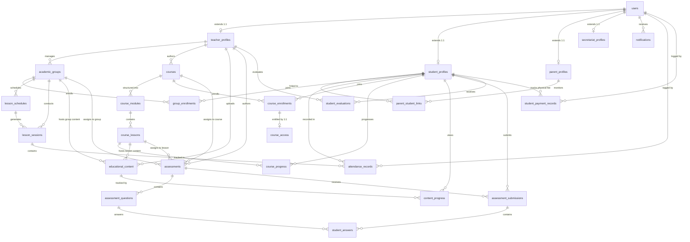

# Database Design Specification

## 1. Document Overview

### 1.1 Purpose
This document defines the conceptual and logical database architecture for the **Educational Management System for Teachers and Students** (El Awal). It specifies the relational data structures, entity models, field definitions, referential integrity constraints, indexing strategies, and lifecycle behaviors required to satisfy the approved product requirements across both **Physical Learning** and **Online Learning** delivery models.

### 1.2 Scope
This specification covers the persistent data requirements for all ten approved product modules:
1. Student Management
2. Attendance & Absence (Physical Classroom)
3. Lectures & Lessons
4. Exams & Assignments
5. Parent Student Status
6. Notifications
7. Groups Management (Physical Classroom)
8. Users & Permissions
9. Subscriptions (Student Payment Status)
10. Online Learning / Courses (Asynchronous Distance Learning)

This document is strictly a **database design specification**. It contains no application source code, ORM code, migration scripts, or SQL implementation scripts.

### 1.3 Audience
- **Database Architects & Backend Engineers**: Responsible for evaluating data structures, relationships, and integrity rules.
- **ORM & Schema Implementers**: Responsible for translating this logical blueprint into ORM schema declarations (e.g., Prisma Schema) and database migrations.
- **QA Engineers**: Responsible for verifying that data constraints, relationships, and persistence logic match test cases.

### 1.4 Source Documents
- [Product Requirements Document (PRD)](file:///d:/el_awal/docs/01-PRD/product-requirements.md)
- [Business Requirements Document](file:///d:/el_awal/docs/01-PRD/business-requirements.md)
- [Functional Requirements Document](file:///d:/el_awal/docs/01-PRD/functional-requirements.md)
- [Data Layer Architecture](file:///d:/el_awal/docs/03-Architecture/data-layer.md)
- [Business Logic Architecture](file:///d:/el_awal/docs/03-Architecture/business-logic.md)

---

## 2. Database Design Principles

1. **Normalization & Minimal Redundancy**: Relational normalization (3NF baseline) is applied to eliminate redundant data storage. Derived values (e.g., total attendance counts, overall course progress percentage) are computed dynamically rather than duplicated in persistent storage.
2. **Referential Integrity & Constraints**: Database-level foreign keys, unique composite indexes, and check constraints enforce domain business rules directly within the database engine.
3. **Explicit Identity vs. Domain Profile Separation**: General user authentication identity is decoupled from domain-specific role profiles (`TeacherProfile`, `StudentProfile`, `ParentProfile`, `SecretariatProfile`), preventing schema pollution across user roles.
4. **Single Student Identity Across Learning Models**: A single `student_profiles` row represents a learner across all physical group enrollments (`group_enrollments`) and online course enrollments (`course_enrollments`).
5. **Strict Domain Boundary Separation**:
   - **Physical Domain**: `academic_groups`, `group_enrollments`, `lesson_schedules`, `lesson_sessions`, `attendance_records`.
   - **Online Learning Domain**: `courses`, `course_modules`, `course_lessons`, `course_enrollments`, `course_access`, `course_progress`.
   - A `Course` is an independent educational product entity, NOT another type of `AcademicGroup`.
6. **Attendance Boundary Invariant**: Physical attendance records (`attendance_records`) attach strictly to physical `lesson_sessions`. Online course enrollments do NOT grant physical attendance eligibility.
7. **Polymorphic / Contextual Educational Assets**: `educational_content` and `assessments` are architected to attach either to a physical `academic_groups` context OR an online `course_lessons`/`courses` context via explicit check constraints.
8. **Decoupled Binary Storage**: Large binary assets (PDF summaries, documents, lecture video recordings) are persisted in external object storage (Cloudflare R2, Bunny Stream); the database stores strictly structured metadata, storage keys, MIME types, and URI references.

---

## 3. Technology Context

### 3.1 PostgreSQL (v16+)
The logical design is optimized for PostgreSQL capabilities:
- **Identifier Strategy**: 128-bit UUID primary keys (UUIDv4) for distributed generation, security against enumeration, and client-generated outbox operation tracking.
- **Temporal Data**: `TIMESTAMP WITH TIME ZONE` (`TIMESTAMPTZ`) for global timestamp accuracy across sessions, submissions, and audit events; `DATE` and `TIME` types for calendar sessions and recurring schedules.
- **Domain Enumerations**: Relational enum types for bounded business states (e.g., User Roles, Attendance Statuses, Assessment Types, Question Types, Submission Statuses, Course Publication Statuses, Course Access Statuses).
- **Structured Semi-Structured Data**: `JSONB` data types for flexible assessment question options without requiring artificial one-to-many option tables for simple multiple-choice questions.

### 3.2 Neon Database Platform
- **Branching Architecture**: Relational schema definitions support isolated development, preview, and production branching.
- **Connection Pooling**: Connection patterns rely on stateless, transaction-safe query execution compatible with Neon connection pooling.

### 3.3 ORM Alignment (Prisma Mapping Readiness)
The logical schema maps cleanly to Prisma ORM:
- Pure relational models with 1:1, 1:N, and N:M junction structures.
- Explicit composite unique constraints representing business exclusivity.
- Clear foreign key naming (`<entity>_id`) and relational cardinalities.

---

## 4. Domain & Module Mapping

| Product Module | Required Logical Entities | Primary Purpose | Related Functional Requirements |
|---|---|---|---|
| **1. Student Management** | `StudentProfile`, `ParentStudentLink` | Stores student demographic profiles, academic status, and parent linkages. | `FR-STU-001..004` |
| **2. Attendance & Absence** | `LessonSession`, `AttendanceRecord` | Captures physical class instances, student unique QR codes, and session roll-call records. | `FR-ATT-001..004` |
| **3. Lectures & Lessons** | `EducationalContent`, `ContentProgress` | Manages file/video metadata and tracks individual student viewing activity across groups and courses. | `FR-LES-001..003` |
| **4. Exams & Assignments** | `Assessment`, `AssessmentQuestion`, `AssessmentSubmission`, `StudentAnswer` | Manages assignment and exam lifecycles, student submissions, and auto-grading across groups and courses. | `FR-EXM-001..007` |
| **5. Parent Student Status** | `StudentEvaluation` | Stores teacher notes, qualitative feedback, and student academic evaluations for parents. | `FR-PAR-001..005` |
| **6. Notifications** | `Notification` | Persists event-triggered alerts for lessons, homework, exams, grades, and absences. | `FR-NOT-001..005` |
| **7. Groups Management** | `AcademicGroup`, `GroupEnrollment`, `LessonSchedule` | Organizes physical student cohorts, recurring lesson timetables, and cohort rosters. | `FR-GRP-001..003` |
| **8. Users & Permissions** | `User`, `TeacherProfile`, `ParentProfile`, `SecretariatProfile` | Represents authenticated user identities and role-specific profile extensions. | `FR-USR-001..004` |
| **9. Subscriptions** | `StudentPaymentRecord` | Tracks physical student fee payment status records without payment gateway processing. | `FR-SUB-001` |
| **10. Online Learning** | `Course`, `CourseModule`, `CourseLesson`, `CourseEnrollment`, `CourseAccess`, `CourseProgress` | Manages asynchronous online course hierarchy, digital enrollments, access entitlements, and lesson progress. | `FR-OL-001..008` |

---

## 5. Entity Identification & Lifecycles

### 5.1 `User`
- **Purpose**: Central identity entity for authentication and system-wide account representation.
- **Lifecycle**: Created during onboarding; updated on profile changes; soft-deactivated (`is_active = false`) upon departure.

### 5.2 `TeacherProfile`
- **Purpose**: Domain profile extension for educators managing physical groups and authoring online courses.
- **Lifecycle**: Created synchronously with `User` having role `TEACHER`; deletion cascades only if no active groups or published courses exist.

### 5.3 `StudentProfile`
- **Purpose**: Domain profile extension for learners tracking grade level, academic status, and unique QR attendance token across physical and online learning.
- **Lifecycle**: Created upon student enrollment with unique `qr_code_token`; hard deletion restricted if attendance, grading, or course progress records exist.

### 5.4 `ParentProfile`
- **Purpose**: Domain profile extension for guardians monitoring student academic standing and online course progress.
- **Lifecycle**: Created when guardian is registered; linked to students via `ParentStudentLink`.

### 5.5 `SecretariatProfile`
- **Purpose**: Domain profile extension for administrative operational staff.
- **Lifecycle**: Created upon staff account provisioning; updated when staff titles change.

### 5.6 `ParentStudentLink`
- **Purpose**: Associative entity establishing guardian-student monitoring relationships (N:M).
- **Lifecycle**: Created upon parent-student verification; deleted if guardianship association is severed.

### 5.7 `AcademicGroup` (Physical Learning)
- **Purpose**: Physical educational cohort/class entity created by an instructor or administrator.
- **Lifecycle**: Created by teacher/admin; marked inactive (`is_active = false`) at end of academic term.

### 5.8 `GroupEnrollment` (Physical Learning)
- **Purpose**: Membership record associating a student with a physical educational group.
- **Lifecycle**: Created when a student is added to a physical group roster; status updated to "TRANSFERRED" or "DROPPED" if student leaves.

### 5.9 `LessonSchedule` (Physical Learning)
- **Purpose**: Recurring weekly timetable definition for a physical academic group.
- **Lifecycle**: Created during group setup; modified when class timing shifts.

### 5.10 `LessonSession` (Physical Learning)
- **Purpose**: Concrete calendar occurrence of a physical class session for attendance tracking.
- **Lifecycle**: Created automatically or manually prior to class; retained indefinitely for attendance history.

### 5.11 `AttendanceRecord` (Physical Learning)
- **Purpose**: Explicit presence, absence, or excused state for a student in a physical lesson session.
- **Lifecycle**: Created during session roll-call via teacher QR scanning or manual entry; retained permanently.

### 5.12 `Course` (Online Learning)
- **Purpose**: Independent asynchronous educational course product.
- **Lifecycle**: Created as `DRAFT`; modified during authoring; transitioned to `PUBLISHED` for catalog discovery; archived as `ARCHIVED` at end of lifecycle.

### 5.13 `CourseModule` (Online Learning)
- **Purpose**: Structured chapter or thematic section within an online course.
- **Lifecycle**: Created during course authoring; ordered sequentially via `order_index`; deletion cascades to child lessons only if no student completion logs exist.

### 5.14 `CourseLesson` (Online Learning)
- **Purpose**: Individual asynchronous instructional unit containing video streaming metadata and reference documents.
- **Lifecycle**: Created under a module; ordered sequentially; links to Bunny Stream video assets and Cloudflare R2 files.

### 5.15 `CourseEnrollment` (Online Learning)
- **Purpose**: Relationship entity establishing a student's enrollment in an online course.
- **Lifecycle**: Created when a student registers or is assigned to a course; retained for historical learning continuity.

### 5.16 `CourseAccess` / `CourseSubscription` (Online Learning)
- **Purpose**: Entitlement record governing whether an enrolled student is currently authorized to access course lesson streams and assets.
- **Lifecycle**: Created synchronously with `CourseEnrollment`; states: `ACTIVE`, `EXPIRED`, `SUSPENDED`.

### 5.17 `CourseProgress` (Online Learning)
- **Purpose**: Granular progress record tracking student viewing position, completion flag, and completion timestamps per lesson.
- **Lifecycle**: Created on first lesson access; updated via progress heartbeats or offline sync dispatches; monotonic completion state.

### 5.18 `EducationalContent` (Shared Reusable Entity)
- **Purpose**: Metadata and storage references for instructional files and lecture recordings attached to a physical group OR an online course lesson.
- **Lifecycle**: Created when file/video upload completes; updated when metadata changes; deleted when teacher revokes content.

### 5.19 `ContentProgress` (Shared Reusable Entity)
- **Purpose**: Access log tracking student engagement with standalone educational files/recordings.
- **Lifecycle**: Created on first view; updated on subsequent accesses.

### 5.20 `Assessment` (Shared Reusable Entity)
- **Purpose**: Unified definition for homework assignments and examinations attached to a physical group OR an online course lesson.
- **Lifecycle**: Created as draft/published; updated with due dates; closed after submission window; retained for grading history.

### 5.21 `AssessmentQuestion`
- **Purpose**: Structured question items for automatically graded examinations.
- **Lifecycle**: Created during exam authoring; locked once student submissions exist.

### 5.22 `AssessmentSubmission`
- **Purpose**: Student submission attempt for an assignment or examination.
- **Lifecycle**: Created upon student submission; updated when auto-graded or evaluated by teacher; immutable after grading completion.

### 5.23 `StudentAnswer`
- **Purpose**: Individual question responses submitted by a student for automatic exam grading.
- **Lifecycle**: Created synchronously with `AssessmentSubmission`; evaluated and scored automatically by grading engine.

### 5.24 `StudentEvaluation`
- **Purpose**: Qualitative evaluation notes and student level feedback recorded by teachers for parents.
- **Lifecycle**: Created by teacher after periodic assessment; visible to parents; retained in student timeline.

### 5.25 `Notification`
- **Purpose**: System-generated alerts delivered to specific user recipients.
- **Lifecycle**: Created upon event trigger; marked read when accessed by user.

### 5.26 `StudentPaymentRecord` (Physical Learning Fee Tracking)
- **Purpose**: Administrative tracking record of student physical group tuition payment status per billing period.
- **Lifecycle**: Created for a billing period; status updated by Secretariat/Teacher; retained for audit history.

---

## 6. Entity Attributes

### 6.1 `users` Table
| Field | Data Type | Required | Unique | Description | Source Requirement |
|---|---|---|---|---|---|
| `id` | UUID | Yes | Yes | Primary identifier | `PRD-009` |
| `full_name` | VARCHAR(200) | Yes | No | User's full display name | `FR-USR-001..004` |
| `phone` | VARCHAR(30) | No | Yes | Primary contact phone number | `FR-USR-001..004` |
| `email` | VARCHAR(255) | No | Yes | Optional email address | `FR-USR-001..004` |
| `role` | VARCHAR(30) (ENUM) | Yes | No | Role: `TEACHER`, `STUDENT`, `PARENT`, `SECRETARIAT` | `FR-USR-001..004` |
| `is_active` | BOOLEAN | Yes | No | Account active status (Default: `true`) | `PRD-009` |
| `created_at` | TIMESTAMPTZ | Yes | No | Timestamp of record creation | Audit Baseline |
| `updated_at` | TIMESTAMPTZ | Yes | No | Timestamp of last modification | Audit Baseline |

### 6.2 `teacher_profiles` Table
| Field | Data Type | Required | Unique | Description | Source Requirement |
|---|---|---|---|---|---|
| `id` | UUID | Yes | Yes | 1:1 foreign key referencing `users.id` | `FR-USR-004` |
| `specialty` | VARCHAR(100) | No | No | Subject specialization (e.g., اللغة العربية) | `FR-USR-004` |
| `bio` | TEXT | No | No | Optional instructor biography | `FR-USR-004` |
| `created_at` | TIMESTAMPTZ | Yes | No | Timestamp of record creation | Audit Baseline |
| `updated_at` | TIMESTAMPTZ | Yes | No | Timestamp of last modification | Audit Baseline |

### 6.3 `student_profiles` Table
| Field | Data Type | Required | Unique | Description | Source Requirement |
|---|---|---|---|---|---|
| `id` | UUID | Yes | Yes | 1:1 foreign key referencing `users.id` | `FR-STU-004` |
| `student_code` | VARCHAR(50) | No | Yes | School/center student identification number | `FR-STU-004` |
| `qr_code_token` | VARCHAR(255) | Yes | Yes | Unique token embedded in student QR code for physical roll-call | `FR-ATT-004`, `PRD-003` |
| `grade_level` | VARCHAR(50) | Yes | No | Academic stage / grade (الصف الدراسي) | `FR-STU-002` |
| `academic_status` | VARCHAR(50) | Yes | No | Status indicator (Default: `"ACTIVE"`) | `FR-STU-001` |
| `date_of_birth` | DATE | No | No | Student date of birth | `FR-STU-004` |
| `emergency_phone` | VARCHAR(30) | No | No | Emergency secondary contact number | `FR-STU-004` |
| `created_at` | TIMESTAMPTZ | Yes | No | Timestamp of record creation | Audit Baseline |
| `updated_at` | TIMESTAMPTZ | Yes | No | Timestamp of last modification | Audit Baseline |

### 6.4 `parent_profiles` Table
| Field | Data Type | Required | Unique | Description | Source Requirement |
|---|---|---|---|---|---|
| `id` | UUID | Yes | Yes | 1:1 foreign key referencing `users.id` | `FR-STU-003` |
| `primary_phone` | VARCHAR(30) | Yes | No | Primary phone number for guardian communication | `FR-STU-003` |
| `relationship_type` | VARCHAR(50) | No | No | Guardian type (e.g., Father, Mother, Guardian) | `FR-STU-003` |
| `created_at` | TIMESTAMPTZ | Yes | No | Timestamp of record creation | Audit Baseline |
| `updated_at` | TIMESTAMPTZ | Yes | No | Timestamp of last modification | Audit Baseline |

### 6.5 `secretariat_profiles` Table
| Field | Data Type | Required | Unique | Description | Source Requirement |
|---|---|---|---|---|---|
| `id` | UUID | Yes | Yes | 1:1 foreign key referencing `users.id` | `FR-USR-001` |
| `staff_title` | VARCHAR(100) | No | No | Administrative job title | `FR-USR-001` |
| `created_at` | TIMESTAMPTZ | Yes | No | Timestamp of record creation | Audit Baseline |
| `updated_at` | TIMESTAMPTZ | Yes | No | Timestamp of last modification | Audit Baseline |

### 6.6 `parent_student_links` Table
| Field | Data Type | Required | Unique | Description | Source Requirement |
|---|---|---|---|---|---|
| `id` | UUID | Yes | Yes | Primary identifier | `FR-STU-003` |
| `parent_id` | UUID | Yes | No | Foreign key referencing `parent_profiles.id` | `FR-STU-003` |
| `student_id` | UUID | Yes | No | Foreign key referencing `student_profiles.id` | `FR-STU-003` |
| `created_at` | TIMESTAMPTZ | Yes | No | Linkage creation timestamp | Audit Baseline |

### 6.7 `academic_groups` Table (Physical Learning)
| Field | Data Type | Required | Unique | Description | Source Requirement |
|---|---|---|---|---|---|
| `id` | UUID | Yes | Yes | Primary identifier | `FR-GRP-003` |
| `name` | VARCHAR(150) | Yes | No | Name of the physical group (اسم المجموعة) | `FR-GRP-003` |
| `grade_level` | VARCHAR(50) | Yes | No | Grade level / academic stage (الصف) | `FR-STU-002` |
| `teacher_id` | UUID | Yes | No | Foreign key referencing `teacher_profiles.id` | `FR-GRP-003` |
| `is_active` | BOOLEAN | Yes | No | Group status flag (Default: `true`) | `FR-GRP-003` |
| `created_at` | TIMESTAMPTZ | Yes | No | Record creation timestamp | Audit Baseline |
| `updated_at` | TIMESTAMPTZ | Yes | No | Record modification timestamp | Audit Baseline |

### 6.8 `group_enrollments` Table (Physical Learning)
| Field | Data Type | Required | Unique | Description | Source Requirement |
|---|---|---|---|---|---|
| `id` | UUID | Yes | Yes | Primary identifier | `FR-GRP-002` |
| `group_id` | UUID | Yes | No | Foreign key referencing `academic_groups.id` | `FR-GRP-002` |
| `student_id` | UUID | Yes | No | Foreign key referencing `student_profiles.id` | `FR-GRP-002` |
| `enrolled_at` | TIMESTAMPTZ | Yes | No | Date/time student joined the physical group | `FR-GRP-002` |
| `status` | VARCHAR(30) | Yes | No | Membership status (Default: `"ACTIVE"`) | `FR-GRP-002` |

### 6.9 `lesson_schedules` Table (Physical Learning)
| Field | Data Type | Required | Unique | Description | Source Requirement |
|---|---|---|---|---|---|
| `id` | UUID | Yes | Yes | Primary identifier | `FR-GRP-001` |
| `group_id` | UUID | Yes | No | Foreign key referencing `academic_groups.id` | `FR-GRP-001` |
| `day_of_week` | INTEGER | Yes | No | Day index (0 = Sunday .. 6 = Saturday) | `FR-GRP-001` |
| `start_time` | TIME | Yes | No | Scheduled lesson start time | `FR-GRP-001` |
| `end_time` | TIME | Yes | No | Scheduled lesson end time | `FR-GRP-001` |
| `location` | VARCHAR(150) | No | No | Classroom or session location name | `FR-GRP-001` |

### 6.10 `lesson_sessions` Table (Physical Learning)
| Field | Data Type | Required | Unique | Description | Source Requirement |
|---|---|---|---|---|---|
| `id` | UUID | Yes | Yes | Primary identifier | `FR-ATT-001` |
| `group_id` | UUID | Yes | No | Foreign key referencing `academic_groups.id` | `FR-ATT-001` |
| `schedule_id` | UUID | No | No | Optional foreign key referencing `lesson_schedules.id` | `FR-GRP-001` |
| `session_date` | DATE | Yes | No | Calendar date of the physical lesson session | `FR-ATT-001` |
| `topic` | VARCHAR(255) | No | No | Lesson topic or title | `FR-ATT-001` |
| `created_at` | TIMESTAMPTZ | Yes | No | Record creation timestamp | Audit Baseline |

### 6.11 `attendance_records` Table (Physical Learning)
| Field | Data Type | Required | Unique | Description | Source Requirement |
|---|---|---|---|---|---|
| `id` | UUID | Yes | Yes | Primary identifier | `FR-ATT-002` |
| `session_id` | UUID | Yes | No | Foreign key referencing `lesson_sessions.id` | `FR-ATT-002` |
| `student_id` | UUID | Yes | No | Foreign key referencing `student_profiles.id` | `FR-ATT-002` |
| `status` | VARCHAR(30) (ENUM) | Yes | No | Status: `PRESENT`, `ABSENT`, `EXCUSED` | `FR-ATT-002`, `FR-ATT-003` |
| `recording_method` | VARCHAR(30) (ENUM) | Yes | No | Method: `QR_SCAN`, `MANUAL` (Default: `"MANUAL"`) | `FR-ATT-004`, `PRD-003` |
| `recorded_by_id` | UUID | Yes | No | Foreign key referencing `users.id` (staff recorder) | Audit / `PRD-003` |
| `recorded_at` | TIMESTAMPTZ | Yes | No | Timestamp when attendance was logged | `FR-ATT-002` |
| `notes` | TEXT | No | No | Attendance / absence justification note | `FR-ATT-001` |

### 6.12 `courses` Table (Online Learning)
| Field | Data Type | Required | Unique | Description | Source Requirement |
|---|---|---|---|---|---|
| `id` | UUID | Yes | Yes | Primary identifier | `PRD-OL-001` |
| `teacher_id` | UUID | Yes | No | Foreign key referencing `teacher_profiles.id` | `FR-OL-001` |
| `title` | VARCHAR(255) | Yes | No | Course title | `FR-OL-001` |
| `description` | TEXT | No | No | Detailed course description | `FR-OL-001` |
| `subject` | VARCHAR(100) | Yes | No | Academic subject (e.g. Physics, Math) | `FR-OL-001` |
| `grade_level` | VARCHAR(50) | Yes | No | Target academic stage / grade | `FR-OL-001` |
| `cover_image_url` | TEXT | No | No | Course cover banner image URL | `FR-OL-001` |
| `status` | VARCHAR(30) (ENUM) | Yes | No | Status: `DRAFT`, `PUBLISHED`, `ARCHIVED` (Default: `"DRAFT"`) | `FR-OL-001` |
| `order_index` | INTEGER | Yes | No | Display ordering index (Default: `0`) | `FR-OL-001` |
| `is_published` | BOOLEAN | Yes | No | Publication flag (Default: `false`) | `FR-OL-001` |
| `created_at` | TIMESTAMPTZ | Yes | No | Timestamp of creation | Audit Baseline |
| `updated_at` | TIMESTAMPTZ | Yes | No | Timestamp of last update | Audit Baseline |

### 6.13 `course_modules` Table (Online Learning)
| Field | Data Type | Required | Unique | Description | Source Requirement |
|---|---|---|---|---|---|
| `id` | UUID | Yes | Yes | Primary identifier | `PRD-OL-001` |
| `course_id` | UUID | Yes | No | Foreign key referencing `courses.id` | `FR-OL-002` |
| `title` | VARCHAR(255) | Yes | No | Module / Section title | `FR-OL-002` |
| `description` | TEXT | No | No | Optional module description | `FR-OL-002` |
| `order_index` | INTEGER | Yes | No | Sequential module order within course | `FR-OL-002` |
| `created_at` | TIMESTAMPTZ | Yes | No | Record creation timestamp | Audit Baseline |
| `updated_at` | TIMESTAMPTZ | Yes | No | Record update timestamp | Audit Baseline |

### 6.14 `course_lessons` Table (Online Learning)
| Field | Data Type | Required | Unique | Description | Source Requirement |
|---|---|---|---|---|---|
| `id` | UUID | Yes | Yes | Primary identifier | `PRD-OL-001` |
| `module_id` | UUID | Yes | No | Foreign key referencing `course_modules.id` | `FR-OL-002` |
| `title` | VARCHAR(255) | Yes | No | Lesson title | `FR-OL-002` |
| `description` | TEXT | No | No | Lesson overview and notes | `FR-OL-002` |
| `order_index` | INTEGER | Yes | No | Sequential lesson order within module | `FR-OL-002` |
| `video_asset_id` | VARCHAR(255) | No | No | Bunny Stream Video ID reference | `FR-OL-004` |
| `video_duration_seconds` | INTEGER | No | No | Video length in seconds | `FR-OL-004` |
| `is_preview` | BOOLEAN | Yes | No | Free preview lesson flag (Default: `false`) | `FR-OL-003` |
| `created_at` | TIMESTAMPTZ | Yes | No | Record creation timestamp | Audit Baseline |
| `updated_at` | TIMESTAMPTZ | Yes | No | Record update timestamp | Audit Baseline |

### 6.15 `course_enrollments` Table (Online Learning)
| Field | Data Type | Required | Unique | Description | Source Requirement |
|---|---|---|---|---|---|
| `id` | UUID | Yes | Yes | Primary identifier | `PRD-OL-002` |
| `course_id` | UUID | Yes | No | Foreign key referencing `courses.id` | `FR-OL-003` |
| `student_id` | UUID | Yes | No | Foreign key referencing `student_profiles.id` | `FR-OL-003` |
| `enrolled_at` | TIMESTAMPTZ | Yes | No | Enrollment timestamp | `FR-OL-003` |
| `status` | VARCHAR(30) (ENUM) | Yes | No | Status: `ACTIVE`, `COMPLETED`, `DROPPED` (Default: `"ACTIVE"`) | `FR-OL-003` |

### 6.16 `course_access` Table (Online Learning Entitlement)
| Field | Data Type | Required | Unique | Description | Source Requirement |
|---|---|---|---|---|---|
| `id` | UUID | Yes | Yes | Primary identifier | `PRD-OL-002` |
| `enrollment_id` | UUID | Yes | Yes | 1:1 foreign key referencing `course_enrollments.id` | `FR-OL-003` |
| `student_id` | UUID | Yes | No | Foreign key referencing `student_profiles.id` | `FR-OL-003` |
| `course_id` | UUID | Yes | No | Foreign key referencing `courses.id` | `FR-OL-003` |
| `access_status` | VARCHAR(30) (ENUM) | Yes | No | Status: `ACTIVE`, `EXPIRED`, `SUSPENDED` (Default: `"ACTIVE"`) | `FR-OL-003` |
| `valid_from` | TIMESTAMPTZ | Yes | No | Entitlement start timestamp | `FR-OL-003` |
| `valid_until` | TIMESTAMPTZ | No | No | Optional access expiration timestamp | `FR-OL-003` |
| `granted_by_id` | UUID | No | No | Foreign key referencing `users.id` (staff granter) | Audit Baseline |
| `created_at` | TIMESTAMPTZ | Yes | No | Record creation timestamp | Audit Baseline |
| `updated_at` | TIMESTAMPTZ | Yes | No | Record update timestamp | Audit Baseline |

### 6.17 `course_progress` Table (Online Learning Progress)
| Field | Data Type | Required | Unique | Description | Source Requirement |
|---|---|---|---|---|---|
| `id` | UUID | Yes | Yes | Primary identifier | `PRD-OL-004` |
| `lesson_id` | UUID | Yes | No | Foreign key referencing `course_lessons.id` | `FR-OL-005` |
| `student_id` | UUID | Yes | No | Foreign key referencing `student_profiles.id` | `FR-OL-005` |
| `course_id` | UUID | Yes | No | Foreign key referencing `courses.id` | `FR-OL-005` |
| `last_position_seconds` | INTEGER | Yes | No | Last playback timestamp in seconds (Default: `0`) | `FR-OL-005` |
| `is_completed` | BOOLEAN | Yes | No | Completion state flag (Default: `false`) | `FR-OL-005` |
| `first_accessed_at` | TIMESTAMPTZ | Yes | No | Initial access timestamp | `FR-OL-005` |
| `completed_at` | TIMESTAMPTZ | No | No | Timestamp when marked completed | `FR-OL-005` |
| `last_synced_at` | TIMESTAMPTZ | Yes | No | Timestamp of most recent server sync | `FR-OL-008` |
| `client_operation_id` | UUID | No | No | Client-generated UUID for offline idempotency | `FR-OL-008` |

### 6.18 `educational_content` Table (Shared Polymorphic Entity)
| Field | Data Type | Required | Unique | Description | Source Requirement |
|---|---|---|---|---|---|
| `id` | UUID | Yes | Yes | Primary identifier | `FR-LES-002`, `FR-OL-004` |
| `teacher_id` | UUID | Yes | No | Foreign key referencing `teacher_profiles.id` | `FR-LES-002` |
| `group_id` | UUID | No | No | Optional foreign key referencing `academic_groups.id` (for physical groups) | `FR-LES-002` |
| `lesson_id` | UUID | No | No | Optional foreign key referencing `course_lessons.id` (for online courses) | `FR-OL-004` |
| `title` | VARCHAR(255) | Yes | No | Content title | `FR-LES-002` |
| `description` | TEXT | No | No | Content description or instructions | `FR-LES-002` |
| `content_type` | VARCHAR(30) (ENUM) | Yes | No | Type: `FILE`, `SUMMARY`, `REFERENCE`, `LECTURE_RECORDING` | `FR-LES-002`, `FR-LES-003` |
| `file_key` | VARCHAR(500) | Yes | No | Object storage key/path in Cloudflare R2 | `FR-LES-002` |
| `file_url` | TEXT | Yes | No | Accessible download/streaming URI | `FR-LES-002` |
| `file_size` | BIGINT | No | No | File size in bytes | Storage Architecture |
| `mime_type` | VARCHAR(100) | No | No | Content MIME type (e.g., `application/pdf`) | Storage Architecture |
| `created_at` | TIMESTAMPTZ | Yes | No | Upload creation timestamp | Audit Baseline |
| `updated_at` | TIMESTAMPTZ | Yes | No | Last update timestamp | Audit Baseline |

### 6.19 `content_progress` Table
| Field | Data Type | Required | Unique | Description | Source Requirement |
|---|---|---|---|---|---|
| `id` | UUID | Yes | Yes | Primary identifier | `FR-LES-001` |
| `content_id` | UUID | Yes | No | Foreign key referencing `educational_content.id` | `FR-LES-001` |
| `student_id` | UUID | Yes | No | Foreign key referencing `student_profiles.id` | `FR-LES-001` |
| `first_viewed_at` | TIMESTAMPTZ | Yes | No | Timestamp of initial access | `FR-LES-001` |
| `last_viewed_at` | TIMESTAMPTZ | Yes | No | Timestamp of most recent access | `FR-LES-001` |
| `view_count` | INTEGER | Yes | No | Number of times accessed (Default: `1`) | `FR-LES-001` |
| `is_completed` | BOOLEAN | Yes | No | Completion state flag (Default: `false`) | `FR-LES-001` |

### 6.20 `assessments` Table (Shared Polymorphic Entity)
| Field | Data Type | Required | Unique | Description | Source Requirement |
|---|---|---|---|---|---|
| `id` | UUID | Yes | Yes | Primary identifier | `FR-EXM-004..007`, `FR-OL-006` |
| `teacher_id` | UUID | Yes | No | Foreign key referencing `teacher_profiles.id` | `FR-EXM-004..007` |
| `group_id` | UUID | No | No | Optional foreign key referencing `academic_groups.id` (physical group) | `FR-EXM-004..007` |
| `course_id` | UUID | No | No | Optional foreign key referencing `courses.id` (online course) | `FR-OL-006` |
| `lesson_id` | UUID | No | No | Optional foreign key referencing `course_lessons.id` (online lesson) | `FR-OL-006` |
| `title` | VARCHAR(255) | Yes | No | Assessment title | `FR-EXM-004..007` |
| `description` | TEXT | No | No | Assessment instructions | `FR-EXM-004..007` |
| `type` | VARCHAR(30) (ENUM) | Yes | No | Type: `ASSIGNMENT`, `EXAM` | `FR-EXM-004..007` |
| `total_score` | DECIMAL(6,2) | Yes | No | Maximum possible marks (Default: `100.00`) | `FR-EXM-002` |
| `passing_score` | DECIMAL(6,2) | No | No | Passing grade threshold | `FR-EXM-002` |
| `is_auto_graded` | BOOLEAN | Yes | No | True for auto-graded exams, false for assignments | `FR-EXM-002` |
| `due_date` | TIMESTAMPTZ | No | No | Submission deadline (`TBD`) | `PRD-005` |
| `created_at` | TIMESTAMPTZ | Yes | No | Record creation timestamp | Audit Baseline |
| `updated_at` | TIMESTAMPTZ | Yes | No | Record update timestamp | Audit Baseline |

### 6.21 `assessment_questions` Table
| Field | Data Type | Required | Unique | Description | Source Requirement |
|---|---|---|---|---|---|
| `id` | UUID | Yes | Yes | Primary identifier | `FR-EXM-007` |
| `assessment_id` | UUID | Yes | No | Foreign key referencing `assessments.id` | `FR-EXM-007` |
| `question_number`| INTEGER | Yes | No | Sequential question order index | `FR-EXM-007` |
| `question_text` | TEXT | Yes | No | Question prompt | `FR-EXM-007` |
| `question_type` | VARCHAR(30) (ENUM) | Yes | No | Type: `MULTIPLE_CHOICE`, `TRUE_FALSE`, `ESSAY` | `FR-EXM-007` |
| `options_data` | JSONB | No | No | Structured choice options for MCQ questions | `FR-EXM-007` |
| `correct_answer`| TEXT | Yes | No | Key or text of correct answer for auto-scoring | `FR-EXM-002` |
| `points` | DECIMAL(5,2) | Yes | No | Points value for question (Default: `1.00`) | `FR-EXM-002` |

### 6.22 `assessment_submissions` Table
| Field | Data Type | Required | Unique | Description | Source Requirement |
|---|---|---|---|---|---|
| `id` | UUID | Yes | Yes | Primary identifier | `FR-EXM-003` |
| `assessment_id` | UUID | Yes | No | Foreign key referencing `assessments.id` | `FR-EXM-003` |
| `student_id` | UUID | Yes | No | Foreign key referencing `student_profiles.id` | `FR-EXM-003` |
| `status` | VARCHAR(30) (ENUM) | Yes | No | Status: `SUBMITTED`, `GRADED`, `UNSOLVED` | `FR-EXM-003`, `FR-PAR-002` |
| `submitted_at` | TIMESTAMPTZ | Yes | No | Timestamp of submission delivery | `FR-EXM-003` |
| `attachment_url` | TEXT | No | No | URL of uploaded homework document/file | `FR-EXM-003` |
| `score_obtained` | DECIMAL(6,2) | No | No | Final awarded score | `FR-EXM-002`, `FR-PAR-003` |
| `is_auto_graded` | BOOLEAN | Yes | No | Whether score was computed automatically | `FR-EXM-002` |
| `graded_at` | TIMESTAMPTZ | No | No | Timestamp of grade confirmation | `FR-EXM-002` |
| `teacher_feedback`| TEXT | No | No | Qualitative comments from instructor | `FR-PAR-001` |

### 6.23 `student_answers` Table
| Field | Data Type | Required | Unique | Description | Source Requirement |
|---|---|---|---|---|---|
| `id` | UUID | Yes | Yes | Primary identifier | `FR-EXM-002` |
| `submission_id` | UUID | Yes | No | Foreign key referencing `assessment_submissions.id` | `FR-EXM-002` |
| `question_id` | UUID | Yes | No | Foreign key referencing `assessment_questions.id` | `FR-EXM-002` |
| `selected_answer`| TEXT | No | No | Student's chosen option or answer | `FR-EXM-002` |
| `is_correct` | BOOLEAN | No | No | Automated grading evaluation result | `FR-EXM-002` |
| `points_earned` | DECIMAL(5,2) | No | No | Automated score awarded for question | `FR-EXM-002` |

### 6.24 `student_evaluations` Table
| Field | Data Type | Required | Unique | Description | Source Requirement |
|---|---|---|---|---|---|
| `id` | UUID | Yes | Yes | Primary identifier | `FR-PAR-001` |
| `student_id` | UUID | Yes | No | Foreign key referencing `student_profiles.id` | `FR-PAR-001` |
| `teacher_id` | UUID | Yes | No | Foreign key referencing `teacher_profiles.id` | `FR-PAR-001` |
| `group_id` | UUID | No | No | Optional foreign key referencing `academic_groups.id` | `FR-PAR-001` |
| `evaluation_date`| DATE | Yes | No | Date of evaluation entry | `FR-PAR-001` |
| `student_level` | VARCHAR(50) | No | No | Qualitative level rating (مستوى الطالب, `TBD rubric`) | `FR-PAR-005` |
| `teacher_notes` | TEXT | Yes | No | Written notes and evaluation comments | `FR-PAR-001` |
| `created_at` | TIMESTAMPTZ | Yes | No | Record creation timestamp | Audit Baseline |

### 6.25 `notifications` Table
| Field | Data Type | Required | Unique | Description | Source Requirement |
|---|---|---|---|---|---|
| `id` | UUID | Yes | Yes | Primary identifier | `FR-NOT-001..005` |
| `recipient_id` | UUID | Yes | No | Foreign key referencing `users.id` | `PRD-008` |
| `type` | VARCHAR(50) (ENUM) | Yes | No | Event type (5 confirmed alert conditions) | `FR-NOT-001..005` |
| `title` | VARCHAR(255) | Yes | No | Notification title summary | `FR-NOT-001..005` |
| `message` | TEXT | Yes | No | Detailed notification body text | `FR-NOT-001..005` |
| `reference_entity_id`| UUID | No | No | Polymorphic ID referencing related session/course/exam | `PRD-008` |
| `is_read` | BOOLEAN | Yes | No | Read status flag (Default: `false`) | Usability Baseline |
| `read_at` | TIMESTAMPTZ | No | No | Timestamp when read | Usability Baseline |
| `created_at` | TIMESTAMPTZ | Yes | No | Notification dispatch timestamp | `FR-NOT-001..005` |

### 6.26 `student_payment_records` Table (Physical Learning)
| Field | Data Type | Required | Unique | Description | Source Requirement |
|---|---|---|---|---|---|
| `id` | UUID | Yes | Yes | Primary identifier | `FR-SUB-001` |
| `student_id` | UUID | Yes | No | Foreign key referencing `student_profiles.id` | `FR-SUB-001` |
| `group_id` | UUID | No | No | Optional foreign key referencing `academic_groups.id` | `FR-SUB-001` |
| `billing_period` | VARCHAR(50) | Yes | No | Billing cycle descriptor (e.g., "October 2026") | `FR-SUB-001` |
| `payment_status` | VARCHAR(50) | Yes | No | Status string (حالة الدفع, `TBD allowed values`) | `FR-SUB-001` |
| `recorded_by_id` | UUID | Yes | No | Foreign key referencing `users.id` (recorder staff) | Audit Baseline |
| `notes` | TEXT | No | No | Administrative remarks | `FR-SUB-001` |
| `created_at` | TIMESTAMPTZ | Yes | No | Record creation timestamp | Audit Baseline |
| `updated_at` | TIMESTAMPTZ | Yes | No | Record modification timestamp | Audit Baseline |

---

## 7. Primary Keys Strategy

1. **Standard Primary Key Type**: All database entities use `UUID` (specifically version 4) as their primary surrogate key.
2. **Rationale**:
   - **Non-Enumerability**: Prevents unauthorized enumeration and URL scraping of student IDs, courses, lessons, and submissions.
   - **Distributed Generation**: Enables safe client-side pre-generation of operation UUIDs for offline outbox queuing.
   - **Database Portability & Sharding**: Facilitates future database partitioning without primary key collision risks.
3. **Internal vs. External Keys**: UUIDs serve as internal system keys. Dedicated unique business columns (`student_code`, `qr_code_token`) handle external identification.

---

## 8. Relationships Matrix

| Parent Entity | Child Entity | Cardinality | Relationship Description | Foreign Key Column | Delete Action | Business Rationale |
|---|---|---|---|---|---|---|
| `users` | `teacher_profiles` | 1:1 | Identity to Teacher Profile | `teacher_profiles.id` | **CASCADE** | Profile is invalid without core user identity. |
| `users` | `student_profiles` | 1:1 | Identity to Student Profile | `student_profiles.id` | **CASCADE** | Profile is invalid without core user identity. |
| `users` | `parent_profiles` | 1:1 | Identity to Parent Profile | `parent_profiles.id` | **CASCADE** | Profile is invalid without core user identity. |
| `users` | `secretariat_profiles` | 1:1 | Identity to Secretariat Profile | `secretariat_profiles.id` | **CASCADE** | Profile is invalid without core user identity. |
| `parent_profiles` | `parent_student_links`| 1:N | Parent monitoring linkage | `parent_student_links.parent_id` | **CASCADE** | Link is removed if parent account is purged. |
| `student_profiles` | `parent_student_links`| 1:N | Student linked to parents | `parent_student_links.student_id` | **CASCADE** | Link is removed if student account is purged. |
| `teacher_profiles` | `academic_groups` | 1:N | Teacher manages physical groups | `academic_groups.teacher_id` | **RESTRICT** | Prevents teacher deletion if active groups exist. |
| `academic_groups` | `group_enrollments` | 1:N | Group contains enrollments | `group_enrollments.group_id` | **CASCADE** | Dissolving group removes active enrollment rows. |
| `student_profiles` | `group_enrollments` | 1:N | Student enrolled in groups | `group_enrollments.student_id` | **RESTRICT** | Prevents student deletion while active enrollments exist. |
| `academic_groups` | `lesson_schedules` | 1:N | Group has recurring schedules | `lesson_schedules.group_id` | **CASCADE** | Schedule definitions belong exclusively to group. |
| `academic_groups` | `lesson_sessions` | 1:N | Group conducts class sessions | `lesson_sessions.group_id` | **CASCADE** | Sessions belong exclusively to group. |
| `lesson_schedules` | `lesson_sessions` | 1:N | Session generated from schedule| `lesson_sessions.schedule_id`| **SET NULL** | Retains session history if schedule changes. |
| `lesson_sessions` | `attendance_records`| 1:N | Session contains attendance | `attendance_records.session_id` | **CASCADE** | Deleting voided session purges its roll-call rows. |
| `student_profiles` | `attendance_records`| 1:N | Student has attendance log | `attendance_records.student_id` | **RESTRICT** | Physical attendance history must never be lost. |
| `users` | `attendance_records`| 1:N | Staff recorded attendance | `attendance_records.recorded_by_id`| **RESTRICT** | Preserves staff accountability for roll-call. |
| `teacher_profiles` | `courses` | 1:N | Teacher authors online courses | `courses.teacher_id` | **RESTRICT** | Prevents teacher deletion if courses exist. |
| `courses` | `course_modules` | 1:N | Course contains ordered modules| `course_modules.course_id` | **CASCADE** | Modules belong exclusively to course. |
| `course_modules` | `course_lessons` | 1:N | Module contains ordered lessons| `course_lessons.module_id` | **CASCADE** | Lessons belong exclusively to module. |
| `courses` | `course_enrollments` | 1:N | Course receives enrollments | `course_enrollments.course_id` | **CASCADE** | Dissolving course removes active enrollments. |
| `student_profiles` | `course_enrollments` | 1:N | Student enrolls in courses | `course_enrollments.student_id` | **RESTRICT** | Protects student course history. |
| `course_enrollments`| `course_access` | 1:1 | Enrollment has entitlement | `course_access.enrollment_id` | **CASCADE** | Entitlement is bound 1:1 to enrollment. |
| `course_lessons` | `course_progress` | 1:N | Lesson has progress logs | `course_progress.lesson_id` | **CASCADE** | Progress rows purged if lesson is deleted. |
| `student_profiles` | `course_progress` | 1:N | Student tracks progress | `course_progress.student_id` | **CASCADE** | Progress belongs to student profile. |
| `academic_groups` | `educational_content`| 1:N | Physical group content | `educational_content.group_id` | **CASCADE** | Content attached to physical group. |
| `course_lessons` | `educational_content`| 1:N | Online lesson content | `educational_content.lesson_id` | **CASCADE** | Content attached to online lesson. |
| `teacher_profiles` | `educational_content`| 1:N | Teacher uploaded content | `educational_content.teacher_id` | **RESTRICT** | Protects authoring accountability. |
| `educational_content`| `content_progress` | 1:N | Content tracking per student | `content_progress.content_id` | **CASCADE** | Tracking row purged if content is deleted. |
| `student_profiles` | `content_progress` | 1:N | Student viewing log | `content_progress.student_id` | **CASCADE** | Tracking log purged if student is deleted. |
| `academic_groups` | `assessments` | 1:N | Group assigned assessment | `assessments.group_id` | **CASCADE** | Assessment belongs to group. |
| `courses` | `assessments` | 1:N | Course assigned assessment | `assessments.course_id` | **CASCADE** | Assessment belongs to course. |
| `course_lessons` | `assessments` | 1:N | Lesson assigned assessment | `assessments.lesson_id` | **CASCADE** | Assessment belongs to lesson. |
| `teacher_profiles` | `assessments` | 1:N | Teacher authored assessment | `assessments.teacher_id` | **RESTRICT** | Protects authoring records. |
| `assessments` | `assessment_questions`| 1:N | Exam contains questions | `assessment_questions.assessment_id`| **CASCADE** | Questions belong to exam. |
| `assessments` | `assessment_submissions`| 1:N | Assessment receives attempts | `assessment_submissions.assessment_id`| **RESTRICT** | Prevents deletion if student attempts exist. |
| `student_profiles` | `assessment_submissions`| 1:N | Student submits assessment | `assessment_submissions.student_id`| **RESTRICT** | Protects academic submissions. |
| `assessment_submissions`| `student_answers` | 1:N | Submission contains answers | `student_answers.submission_id`| **CASCADE** | Answers belong to submission. |
| `assessment_questions`| `student_answers` | 1:N | Question answered by student | `student_answers.question_id` | **RESTRICT** | Prevents question deletion if answers exist. |
| `student_profiles` | `student_evaluations`| 1:N | Student receives evaluations | `student_evaluations.student_id` | **CASCADE** | Evaluations belong to student. |
| `teacher_profiles` | `student_evaluations`| 1:N | Teacher writes evaluation | `student_evaluations.teacher_id` | **RESTRICT** | Protects authoring accountability. |
| `users` | `notifications` | 1:N | User receives alerts | `notifications.recipient_id` | **CASCADE** | User deletion cleans up notifications. |
| `student_profiles` | `student_payment_records`| 1:N | Student has payment records | `student_payment_records.student_id`| **RESTRICT** | Financial records must not be lost. |

---

## 9. Entity Relationship Diagram (ERD)

---

## 10. Database Constraints Matrix

| Entity | Constraint Name | Constraint Type | Target Columns / Expression | Business Purpose | Source |
|---|---|---|---|---|---|
| `users` | `pk_users` | Primary Key | `id` | Unique user identity | `PRD-009` |
| `users` | `uq_users_phone` | Unique | `phone` | Prevent duplicate phone registration | `FR-USR-001..004` |
| `users` | `uq_users_email` | Unique | `email` | Prevent duplicate email registration | `FR-USR-001..004` |
| `student_profiles` | `uq_students_code` | Unique | `student_code` | Prevent duplicate student ID numbers | `FR-STU-004` |
| `student_profiles` | `uq_student_qr_code` | Unique | `qr_code_token` | Guarantee global uniqueness of student QR codes | `FR-ATT-004`, `PRD-003` |
| `parent_student_links`| `uq_parent_student` | Composite Unique | `[parent_id, student_id]` | Prevent duplicate guardian linkages | `FR-STU-003` |
| `group_enrollments` | `uq_group_student` | Composite Unique | `[group_id, student_id]` | Prevent duplicate physical group enrollment | `FR-GRP-002` |
| `lesson_sessions` | `uq_group_session_date` | Composite Unique | `[group_id, session_date]` | Prevent duplicate session logs on same day | `FR-ATT-001` |
| `attendance_records` | `uq_session_student` | Composite Unique | `[session_id, student_id]` | Prevent duplicate roll-call entry (enables idempotent QR scans) | `FR-ATT-002`, `FR-ATT-004` |
| `course_modules` | `uq_course_module_order`| Composite Unique | `[course_id, order_index]` | Guarantee unique module ordering within course | `FR-OL-002` |
| `course_lessons` | `uq_module_lesson_order`| Composite Unique | `[module_id, order_index]` | Guarantee unique lesson ordering within module | `FR-OL-002` |
| `course_enrollments` | `uq_course_student` | Composite Unique | `[course_id, student_id]` | Prevent duplicate course enrollment | `FR-OL-003` |
| `course_access` | `uq_access_enrollment` | Unique | `enrollment_id` | 1:1 entitlement mapping per enrollment | `FR-OL-003` |
| `course_progress` | `uq_lesson_student_progress`| Composite Unique | `[lesson_id, student_id]` | Single progress record per lesson per student | `FR-OL-005` |
| `educational_content`| `chk_content_context` | Check Constraint | `(group_id IS NOT NULL AND lesson_id IS NULL) OR (group_id IS NULL AND lesson_id IS NOT NULL)` | Content must belong to group OR course lesson | `FR-LES-002`, `FR-OL-004` |
| `content_progress` | `uq_content_student` | Composite Unique | `[content_id, student_id]` | Single tracking record per content asset | `FR-LES-001` |
| `assessments` | `chk_assessment_context`| Check Constraint | `(group_id IS NOT NULL AND course_id IS NULL AND lesson_id IS NULL) OR (group_id IS NULL AND (course_id IS NOT NULL OR lesson_id IS NOT NULL))` | Assessment belongs to group OR course/lesson | `FR-EXM-004`, `FR-OL-006` |
| `assessment_questions`| `uq_assessment_question`| Composite Unique | `[assessment_id, question_number]`| Unique ordering of exam questions | `FR-EXM-007` |
| `assessment_submissions`| `uq_assessment_student`| Composite Unique | `[assessment_id, student_id]` | One submission attempt per assessment | `FR-EXM-003` |
| `student_answers` | `uq_submission_question`| Composite Unique | `[submission_id, question_id]` | Single response per question in attempt | `FR-EXM-002` |
| `student_payment_records`| `uq_student_billing` | Composite Unique | `[student_id, billing_period]` | One payment record per billing cycle | `FR-SUB-001` |

---

## 11. Database Index Matrix

| Entity | Index Name | Indexed Columns | Target Query / Access Pattern |
|---|---|---|---|
| `users` | `idx_users_role` | `[role]` | Filtering user directories by role type |
| `users` | `idx_users_phone` | `[phone]` | Sub-millisecond identity lookup |
| `student_profiles` | `idx_students_qr_code` | `[qr_code_token]` | Resolving student identity from scanned QR token (<500ms) |
| `academic_groups` | `idx_groups_teacher` | `[teacher_id]` | Loading instructor's active physical groups |
| `group_enrollments` | `idx_enrollments_student` | `[student_id]` | Retrieving student's physical groups |
| `lesson_sessions` | `idx_sessions_group_date` | `[group_id, session_date]` | Session timetable and calendar roll-call lookup |
| `attendance_records`| `idx_attendance_student_status` | `[student_id, status]` | Calculating student attendance & absence counts |
| `attendance_records`| `idx_attendance_session` | `[session_id]` | Loading session attendance roster |
| `courses` | `idx_courses_teacher` | `[teacher_id]` | Loading instructor's authored courses |
| `courses` | `idx_courses_status_grade` | `[status, grade_level]` | Public Course Catalog queries |
| `course_modules` | `idx_modules_course_order`| `[course_id, order_index]` | Loading ordered course outline |
| `course_lessons` | `idx_lessons_module_order`| `[module_id, order_index]` | Loading ordered lessons within module |
| `course_enrollments` | `idx_course_enrollments_student`| `[student_id, status]` | Loading student's active enrolled courses ("My Courses") |
| `course_access` | `idx_course_access_student` | `[student_id, access_status]` | Verifying active course access entitlement |
| `course_progress` | `idx_course_progress_student` | `[student_id, course_id]` | Computing overall course completion percentage |
| `educational_content`| `idx_content_group_type` | `[group_id, content_type]` | Filtering physical group materials |
| `educational_content`| `idx_content_lesson_type` | `[lesson_id, content_type]` | Loading online lesson assets |
| `content_progress` | `idx_progress_student` | `[student_id]` | Student viewing completion status query |
| `assessments` | `idx_assessments_group_type` | `[group_id, type]` | Listing physical group assessments |
| `assessments` | `idx_assessments_course_type`| `[course_id, type]` | Listing online course assessments |
| `assessment_submissions`| `idx_submissions_assessment_status`| `[assessment_id, status]` | Teacher grading queue filtering |
| `assessment_submissions`| `idx_submissions_student` | `[student_id]` | Student and parent grade report queries |
| `student_evaluations`| `idx_evaluations_student_date` | `[student_id, evaluation_date]` | Parent feedback and notes timeline |
| `notifications` | `idx_notifications_recipient_unread` | `[recipient_id, is_read, created_at]` | Loading unread notification feed |
| `student_payment_records`| `idx_payments_student` | `[student_id]` | Individual student payment record check |

---

## 12. Requirement Traceability Matrix

| Proposed Entity | Related Functional Requirement | Related Product Requirement | Related Backlog Item / Domain | System Actor |
|---|---|---|---|---|
| `users` | `FR-USR-001..004` | `PRD-009` | `المستخدمون والصلاحيات` | All Roles |
| `teacher_profiles` | `FR-USR-004` | `PRD-009` | `المدرس` | Teacher |
| `student_profiles` | `FR-STU-001..004`, `FR-ATT-004` | `PRD-001`, `PRD-003` | `بيانات الطالب`, `حالة الطلاب`, `رمز QR` | Student, Admin |
| `parent_profiles` | `FR-STU-003`, `FR-USR-002` | `PRD-001`, `PRD-009` | `بيانات ولي الامر` | Parent |
| `secretariat_profiles`| `FR-USR-001` | `PRD-009` | `السكرتارية` | Secretariat |
| `parent_student_links`| `FR-STU-003`, `FR-PAR-001..005`, `FR-OL-007`| `PRD-001`, `PRD-007`, `PRD-OL-006` | `عرض النتائج لي ولي الامر` | Parent, Student |
| `academic_groups` | `FR-GRP-003`, `FR-STU-002` | `PRD-002` | `انشاء مجموعة`, `المجموعة و الصف` | Teacher, Secretariat |
| `group_enrollments` | `FR-GRP-002` | `PRD-002` | `اضافة طلاب` | Teacher, Student |
| `lesson_schedules` | `FR-GRP-001` | `PRD-002` | `تحديد مواعيد الدروس` | Teacher |
| `lesson_sessions` | `FR-ATT-001..004` | `PRD-003` | `تقارير الحضور و الغياب`, `تسجيل حضور الطلاب` | Teacher |
| `attendance_records`| `FR-ATT-002..004` | `PRD-003` | `تسجيل حضور الطلاب`, `تسجيل الغياب`, `مسح QR` | Teacher |
| `courses` | `FR-OL-001` | `PRD-OL-001` | `ادارة الدورات التدريبية عبر الإنترنت` | Teacher, Secretariat |
| `course_modules` | `FR-OL-002` | `PRD-OL-001` | `هيكلة الوحدات الرقمية` | Teacher |
| `course_lessons` | `FR-OL-002`, `FR-OL-004` | `PRD-OL-001`, `PRD-OL-003` | `هيكلة الدروس الرقمية` | Teacher, Student |
| `course_enrollments` | `FR-OL-003` | `PRD-OL-002` | `الالتحاق بالدورة الرقمية` | Student, Secretariat |
| `course_access` | `FR-OL-003` | `PRD-OL-002` | `صلاحية الوصول للدورة` | System, Admin |
| `course_progress` | `FR-OL-005`, `FR-OL-008` | `PRD-OL-004`, `PRD-OL-007` | `متابعة التقدم في الدورات` | Student, Parent, Teacher |
| `educational_content`| `FR-LES-002..003`, `FR-OL-004` | `PRD-004`, `PRD-OL-003` | `رفع الملفات`, `رفع تسجيلات المحاضرات` | Teacher, Student |
| `content_progress` | `FR-LES-001` | `PRD-004` | `متابعة مشاهدة المحتوى` | Student, Teacher |
| `assessments` | `FR-EXM-004..007`, `FR-OL-006` | `PRD-005`, `PRD-OL-005` | `انشاء الواجبات والامتحانات` | Teacher, Student |
| `assessment_questions`| `FR-EXM-007`, `FR-EXM-002` | `PRD-005`, `PRD-006` | `تصحيح الدرجات تلقائي` | Teacher |
| `assessment_submissions`| `FR-EXM-003`, `FR-EXM-002` | `PRD-005`, `PRD-006` | `تسليم الواجبات و الامتحانات` | Student, Teacher |
| `student_answers` | `FR-EXM-002` | `PRD-006` | `تصحيح الدرجات تلقائي` | Student, System |
| `student_evaluations`| `FR-PAR-001`, `FR-PAR-005` | `PRD-007` | `تقييمات + ملاحظات المدرس` | Teacher, Parent |
| `notifications` | `FR-NOT-001..005` | `PRD-008` | `اشعارات` | All Roles |
| `student_payment_records`| `FR-SUB-001` | `PRD-010` | `حالة الدفع لكل طالب` | Secretariat, Teacher |

---

## 13. Open Database Design Decisions

| ID | Open Database Design Question | Database Architecture Impact | Related Requirement | Status |
|---|---|---|---|---|
| **DB-OQ-001** | What are the exact allowed lifecycle values for student payment status (`حالة الدفع لكل طالب`)? | Determines whether `payment_status` should become a strict PostgreSQL ENUM. | `FR-SUB-001`, `PRD-010` | `TBD — Requires Product Clarification` |
| **DB-OQ-002** | Can students submit multiple attempts for an assignment or examination? | Impacts `assessment_submissions` uniqueness constraint (`[assessment_id, student_id]` vs `[assessment_id, student_id, attempt_number]`). | `FR-EXM-003`, `PRD-005` | `TBD — Requires Product Clarification` |
| **DB-OQ-003** | How is "Student Level" (`مستوى الطالب`) structured? | Determines whether `student_level` is stored in `student_evaluations` or computed dynamically. | `FR-PAR-005`, `PRD-007` | `TBD — Requires Product Clarification` |
| **DB-OQ-004** | What authentication provider / credential storage scheme will be adopted? | Determines whether `users` requires password hashes, OAuth IDs, or SMS tokens. | NFR Security, `PRD-009` | `TBD — Requires Product Clarification` |
| **DB-OQ-005** | What commercial payment tables or gateway transactions are required for course checkouts? | Deferred until commercial payment model is approved. | `PRD-OL-002`, `FR-OL-003` | `TBD — Requires Product Clarification` |

---

## 14. Final Consistency Audit & Summary

### 14.1 Requirement Coverage
- **100% Traceability**: Every entity maps directly to an approved Functional Requirement (`FR-*`), Product Requirement (`PRD-*`), and Backlog item.
- **Zero Scope Creep**: Commercial payment checkouts, live WebRTC video rooms, and student chat rooms remain explicitly deferred.

### 14.2 Implementation Decoupling
- **Design-Only Output**: The document contains **zero** Prisma model definitions, `@relation` decorators, SQL migration scripts, or application code.
- **Conceptual Database Types**: All fields are specified using standard relational database types (`UUID`, `VARCHAR`, `TEXT`, `INTEGER`, `BOOLEAN`, `DATE`, `TIMESTAMPTZ`, `DECIMAL`, `JSONB`).

### 14.3 Final Status
**READY FOR ARCHITECTURAL REVIEW**
