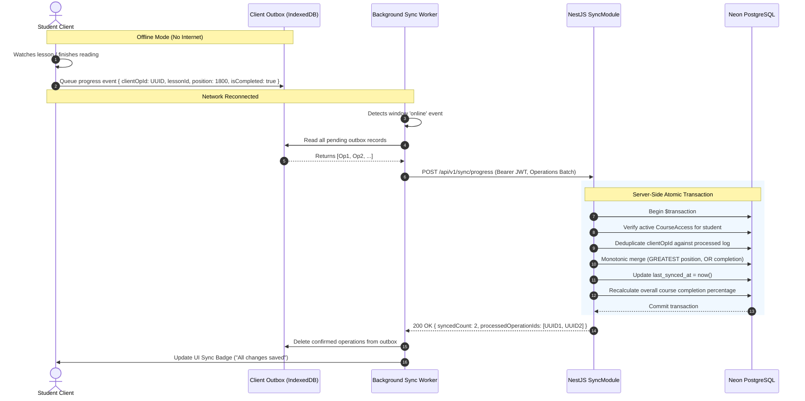

# Offline-First & Data Synchronization Architecture Specification

## 1. Document Information

- **Document Name**: Offline-First & Data Synchronization Architecture Specification (مخطط بنية العمل بدون اتصال ومزامنة البيانات)
- **Document Type**: System Architecture Specification
- **Product**: Educational Management System for Teachers and Students (El Awal / منصة الأول التعليمية)
- **Version**: 1.0.0
- **Status**: Approved Architecture Baseline
- **Source of Truth**:
  - [Business Requirements](file:///d:/el_awal/docs/01-PRD/business-requirements.md)
  - [Product Requirements](file:///d:/el_awal/docs/01-PRD/product-requirements.md)
  - [Functional Requirements](file:///d:/el_awal/docs/01-PRD/functional-requirements.md)
  - [Non-Functional Requirements](file:///d:/el_awal/docs/01-PRD/non-functional-requirements.md)
  - [Database Design](file:///d:/el_awal/docs/03-Architecture/database-design.md)
  - [Backend Architecture](file:///d:/el_awal/docs/03-Architecture/backend-architecture.md)
  - [Frontend Architecture](file:///d:/el_awal/docs/03-Architecture/frontend-architecture.md)
  - [API Design Specification](file:///d:/el_awal/docs/03-Architecture/api-design.md)

---

## 2. Architectural Overview & Objectives

In educational contexts across Egypt and regional developing markets, student and teacher client devices regularly experience intermittent, slow, or completely disconnected network environments. The **Offline-First & Data Synchronization Architecture** guarantees that:

1. **Uninterrupted Learning Experience**: Students can browse previously cached course outlines, read downloaded PDF summaries, and interact with course materials even when disconnected.
2. **Durable Local State Staging**: Progress events (playback timestamps, lesson completions, reading milestones) are reliably persisted on the client in a durable outbox queue.
3. **Zero Data Loss on Reconnection**: When connectivity is restored, the client background worker flushes queued operations to the server in an atomic, idempotent batch.
4. **Server Authority & Cryptographic Integrity**: Local client storage is strictly a cache and mutation queue; the cloud database (PostgreSQL on Neon) remains the sole authoritative source for access entitlement, grading, and historical record validation.

---

## 3. Storage Boundary: Local Database vs. Cloud Storage

```text
┌─────────────────────────────────────────────────────────────────────────────────────────┐
│                                 CLIENT DEVICE BOUNDARY                                  │
│                                                                                         │
│  ┌─────────────────────────────────────────┐  ┌──────────────────────────────────────┐  │
│  │     Client Local Cache (IndexedDB)      │  │     Client Outbox Queue (IndexedDB)  │  │
│  │  - Course Outlines & Lesson Metadata    │  │  - Queued Progress Events            │  │
│  │  - Cached User Profile Information      │  │  - Client Operation UUIDs (v4)      │  │
│  │  - Downloaded PDF Reference Blobs (Opt) │  │  - Pending Sync Retry Counters      │  │
│  └─────────────────────────────────────────┘  └───────────────────┬──────────────────┘  │
└───────────────────────────────────────────────────────────────────┼─────────────────────┘
                                                                    │
                                                                    │ HTTPS / Batch Sync
                                                                    │ (POST /api/v1/sync/progress)
                                                                    ▼
┌─────────────────────────────────────────────────────────────────────────────────────────┐
│                                  CLOUD SERVER BOUNDARY                                  │
│                                                                                         │
│  ┌─────────────────────────────────────────┐  ┌──────────────────────────────────────┐  │
│  │      NestJS SyncModule & PostgreSQL     │  │   Cloud Object & Media Storage       │  │
│  │  - Authoritative course_progress Table  │  │  - Cloudflare R2 (PDFs / Documents)  │  │
│  │  - Authoritative course_access Security │  │  - Bunny Stream (Adaptive Video HLS) │  │
│  │  - Monotonic Progress Merging Engine    │  │  - Zero Large Binary Storage in DB   │  │
│  └─────────────────────────────────────────┘  └──────────────────────────────────────┘  │
└─────────────────────────────────────────────────────────────────────────────────────────┘
```

### 3.1 Media Storage Decoupling Invariant
- **Local Database (IndexedDB / SQLite)**: Contains **only structured metadata** (course titles, module orders, lesson durations, progress percentages) and pending sync outbox payloads.
- **Large Binary Files**: Lecture video recordings and large PDF summaries are **never** stored inside PostgreSQL and **never** serialized into relational database tables.
- Video playback is streamed on-demand via **Bunny Stream** adaptive bitrate HLS. Documents are served via **Cloudflare R2** presigned URLs.

---

## 4. Conflict Resolution Strategy: Server-Authoritative Monotonic Merging

Because multiple client devices (e.g., mobile phone and laptop) may produce progress events while disconnected, the system enforces **deterministic conflict resolution** governed by mathematical monotonicity.

### 4.1 Progress Position Merge Rule
The server merges playback positions using the `GREATEST` monotonic operator:
$$\text{last\_position\_seconds}_{\text{server}} = \max\left( \text{last\_position\_seconds}_{\text{existing}}, \text{last\_position\_seconds}_{\text{incoming}} \right)$$

### 4.2 Completion State Merge Rule
Lesson completion represents an irreversible milestone. It is merged using the logical `OR` boolean operator:
$$\text{is\_completed}_{\text{server}} = \text{is\_completed}_{\text{existing}} \lor \text{is\_completed}_{\text{incoming}}$$

If a lesson is marked completed on the server, an older incoming heartbeat indicating `isCompleted: false` can **never** unmark or reverse the completed status.

### 4.3 Idempotency via Client Operation UUIDs
Each offline operation is stamped at creation time with a client-generated UUIDv4 (`client_operation_id`).
- When the batch arrives at the server, the server records the processed `client_operation_id` in the `course_progress` log.
- If network flapping causes the client to retransmit the same batch, the server recognizes the existing `client_operation_id` and acknowledges it without re-executing business logic or corrupting audit timestamps.

---

## 5. Synchronization Protocol & Sequence Flow



---

## 6. Network Flapping, Exponential Backoff & Retry Policies

When network conditions are unstable (flapping between connected and disconnected states):

1. **Debouncing**: The client sync worker waits **2,000ms** after detecting an `online` event before dispatching the outbox flush to prevent thrashing during rapid connection toggling.
2. **Exponential Backoff with Jitter**: If the server returns a 5xx error or a network timeout occurs:
   $$\text{Retry Interval} = \min\left( \text{Base Delay} \times 2^{\text{retry\_count}} + \text{Jitter}, \text{Max Delay} \right)$$
   - `Base Delay`: 1,000ms
   - `Max Delay`: 30,000ms
   - `Jitter`: Random offset between 0ms and 1,000ms.
3. **Queue Eviction & Age-Out**: Staged progress operations are retained in the local IndexedDB outbox for up to **30 days** until successfully synced.

---

## 7. Security & Anti-Tampering Invariants

1. **JWT Verification**: The `/api/v1/sync/progress` endpoint requires a valid, unexpired `STUDENT` Bearer JWT.
2. **Identity Derivation**: The server enforces that `studentId` is extracted strictly from the authenticated JWT token payload, preventing a student from submitting progress on behalf of another user ID.
3. **Course Access Verification**: If a student's `CourseAccess` status transitioned to `EXPIRED` or `SUSPENDED` while they were offline, the server gracefully rejects progress updates for that specific course with error code `COURSE_ACCESS_EXPIRED`.
4. **Assessment Isolation**: Online exam submissions (`/api/v1/assessments/:id/submit`) require real-time server connectivity for timestamp validation and single-attempt integrity enforcement; exam questions and answers are **not** submitted via the background offline progress outbox.

---

## 8. Architectural Audit & Verification

| Architectural Requirement | Verification Criteria | Status |
|---|---|---|
| **Decoupled Binary Storage** | Zero video/large PDF data stored in local SQLite or PostgreSQL tables. | **PASSED** |
| **Server Authority** | Cloud database is sole authority for entitlement, grades, and progress state. | **PASSED** |
| **Monotonic Progress Merging** | `GREATEST(pos)` and `OR(completed)` mathematical invariants enforced. | **PASSED** |
| **Idempotent Batch Intake** | Unique `client_operation_id` prevents duplicate processing on network retry. | **PASSED** |
| **QR Attendance Separation** | Offline sync engine strictly handles Online Courses; zero interaction with QR attendance. | **PASSED** |
