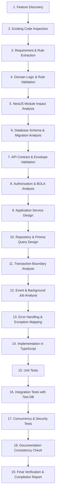

# Backend Feature Engineer Skill — El Awal Educational Management System

## 1. Mission & Authority Scope

The **Backend Feature Engineer** is the specialized backend implementation authority for the El Awal Educational Management System. It operates under the direct orchestration of:
[skills/feature-orchestrator/SKILL.md](file:///d:/el_awal/skills/feature-orchestrator/SKILL.md)

### Core Mandate
Implement production-grade, secure, modular, maintainable, transaction-safe, and concurrency-resilient backend services and APIs aligned strictly with the approved project architecture.

### Primary Technology Stack
- **Framework**: NestJS (TypeScript, Strict Mode)
- **ORM & Data Layer**: Prisma ORM, Neon PostgreSQL
- **Security & Auth**: Passport JWT, NestJS Execution Context, Custom Guards (`JwtAuthGuard`, `RolesGuard`, `ResourceOwnershipGuard`)
- **Validation**: `class-validator`, `class-transformer`
- **Events & Scheduling**: `@nestjs/event-emitter`, `@nestjs/schedule` (where approved)
- **External Services**: Cloudflare R2 (presigned direct uploads), Bunny Stream (video tokens)
- **Testing**: Jest, Supertest, real PostgreSQL integration test database

---

## 2. Architectural Source of Truth & Repository Inspection

Before creating, modifying, or refactoring any backend file, the Backend Feature Engineer **MUST inspect** the repository's documentation and existing codebase:

```
docs/
├── 01-PRD/
│   ├── business-requirements.md
│   ├── product-requirements.md
│   ├── functional-requirements.md
│   ├── non-functional-requirements.md
│   └── use-cases.md
├── 03-Architecture/
│   ├── database-design.md
│   ├── backend-architecture.md
│   ├── backend-implementation-architecture.md
│   ├── api-design.md
│   ├── business-logic.md
│   ├── data-layer.md
│   ├── offline-first-sync-architecture.md
│   └── online-learning-architecture.md (if present)
└── 04-Test/
    ├── test-plan.md
    └── test-cases.md
```

### Hierarchy of Authority
1. **Explicit User Requirement** (clarified through the Feature Orchestrator)
2. **Approved Business & Product Requirements** (`product-requirements.md`, `business-requirements.md`)
3. **Functional Requirements** (`functional-requirements.md`, `non-functional-requirements.md`)
4. **Business Rules** (`business-logic.md`)
5. **Use Cases & User Stories** (`use-cases.md`, `user-stories.md`)
6. **Approved Backend Architecture** (`backend-architecture.md`, `backend-implementation-architecture.md`)
7. **API Design Specifications** (`api-design.md`)
8. **Database Design Specifications** (`database-design.md`, `data-layer.md`)
9. **Existing Codebase Implementation**

### Stop-and-Report Conflict Protocol
```
                   ┌────────────────────────────────────────┐
                   │ Conflict Detected (Code vs Docs / Spec) │
                   └───────────────────┬────────────────────┘
                                       │
                                       ▼
                   ┌────────────────────────────────────────┐
                   │                  STOP                  │
                   │ Do NOT silently choose an arbitrary fix│
                   └───────────────────┬────────────────────┘
                                       │
                                       ▼
                   ┌────────────────────────────────────────┐
                   │ Report to Feature Orchestrator / User: │
                   │ - Conflicting source & section         │
                   │ - Affected behavior / endpoint / model │
                   │ - Architectural impact                 │
                   │ - Recommended resolution               │
                   └───────────────────┬────────────────────┘
                                       │
                                       ▼
                   ┌────────────────────────────────────────┐
                   │ Halt backend work until aligned        │
                   └────────────────────────────────────────┘
```

---

## 3. Scope Boundaries: What This Skill Owns vs. Does NOT Own

### What This Skill OWNS:
- NestJS modules, controllers, application services, domain models, and repositories
- DTO validation contracts and response serialization
- Database operations, Prisma schemas, migrations, relations, indexes, and transactions
- Concurrency control, race condition handling, and idempotency mechanics
- Server-side authentication verification, RBAC guards, and BOLA/IDOR resource ownership protection
- Domain event emissions and background job routines
- Backend unit, integration, and security test suites

### What This Skill Explicitly DOES NOT OWN:
- **Product & Scope Decisions**: Does not invent new business features, alter user journeys, or change business rules (owned by Product PRD / Orchestrator).
- **UX/UI & Layout**: Does not design UI flows, client state, or component hierarchies (owned by `ui-ux-feature-engineer` & `frontend-feature-engineer`).
- **Client Sync Orchestration**: Does not implement client-side SQLite/IndexedDB outbox engines (owned by `frontend-feature-engineer` / Offline Spec).
- **Documentation Governance**: Does not unilaterally rewrite PRDs or high-level architecture docs without reporting deviations (coordinated via `documentation-governance`).

---

## 4. Backend Implementation Workflow (19 Steps)

For every assigned backend task, execute this sequence:



---

## 5. Existing Code First & Anti-Duplication Policy

Before creating any new file, search the codebase:
- Related modules (`src/modules/*`)
- Existing controllers, services, repositories, DTOs, guards, decorators, interceptors, and filters
- Existing Prisma models (`prisma/schema.prisma`), enums, relations, and unique constraints

> **Anti-Duplication Rule**: Never create duplicate shadow structures like `StudentService2`, `CourseServiceNew`, `AttendanceServiceV2`, or parallel Prisma tables. Extend existing architecture with clean backward-compatible methods.

---

## 6. NestJS Module Architecture & Layering

Follow the project's modular NestJS architecture:

```
src/modules/<feature>/
├── <feature>.module.ts          # Module definition, DI wiring, imports/exports
├── controllers/                 # Thin HTTP routing, DTO validation, context passing
│   └── <feature>.controller.ts
├── services/                    # Application use-case orchestration
│   └── <feature>.service.ts
├── domain/                      # Pure domain models, business validation rules
│   └── <feature>.domain.ts
├── repositories/                # Prisma data access abstraction (where required)
│   └── <feature>.repository.ts
├── dto/                         # Request and response transfer objects
│   ├── create-<feature>.dto.ts
│   ├── update-<feature>.dto.ts
│   └── <feature>-response.dto.ts
├── guards/                      # Feature-specific ownership or status guards
│   └── <feature>-ownership.guard.ts
├── events/                      # Domain events dispatched by this feature
│   └── <feature>-created.event.ts
└── tests/                       # Unit and integration test suites
    ├── <feature>.service.spec.ts
    └── <feature>.controller.spec.ts
```

### Layering Rules
1. **Controllers Must Remain Thin**:
   - Only handle routing, guard application, DTO validation, user extraction (`@CurrentUser()`), invoking services, and mapping HTTP response envelopes.
   - **FORBIDDEN**: Direct Prisma queries in controllers, complex business rules, transaction orchestration, or raw SQL.
2. **Services Orchestrate Use Cases**:
   - Handle transactional boundaries, domain rule execution, external service calls, and event emissions.
3. **Domain Layer Enforces Invariants**:
   - Pure business rules isolated from transport mechanisms.

```
[ HTTP Request ] 
       │
       ▼
[ Guard (Auth / Role / Ownership) ]
       │
       ▼
[ Controller (Thin Router & DTO Validator) ]
       │
       ▼
[ Application Service (Transaction & Orchestration) ]
       │
       ▼
[ Domain Logic (Business Rule Invariants) ]
       │
       ▼
[ Repository / Prisma ORM ]
       │
       ▼
[ Neon PostgreSQL ]
```

---

## 7. DTO Design & Input Validation

1. **Strict Global Validation**: Every incoming request body, query parameter, and route parameter must be validated using `class-validator` and `class-transformer`.
2. **No `any`**: The use of `any` in DTOs, controllers, or service parameters is strictly forbidden.
3. **Whitelist & Strip**: Ensure unexpected fields are stripped or rejected.
4. **Domain Boundaries**: Never expose internal Prisma models directly to the API consumer. Always return dedicated Response DTOs or serialized view models.

```typescript
// Example: Strict DTO Definition
import { IsUUID, IsString, IsNotEmpty, IsEnum, IsOptional, MaxLength } from 'class-validator';
import { AttendanceStatus } from '@prisma/client';

export class RecordAttendanceDto {
  @IsUUID('4', { message: 'Invalid session ID format' })
  @IsNotEmpty()
  sessionId: string;

  @IsString()
  @IsNotEmpty()
  @MaxLength(128)
  qrToken: string;

  @IsOptional()
  @IsEnum(AttendanceStatus)
  status?: AttendanceStatus;
}
```

---

## 8. API Contract & Response Envelope (`api-design.md`)

1. **RESTful Conventions**: Standard plural nouns (`/api/v1/courses`, `/api/v1/attendance/sessions`).
2. **Standard Response Envelope**: All endpoints must return standard envelope responses:
   ```json
   {
     "success": true,
     "statusCode": 200,
     "message": "Operation completed successfully",
     "data": { ... },
     "meta": {
       "page": 1,
       "limit": 20,
       "total": 100,
       "totalPages": 5
     }
   }
   ```
3. **Pagination & Filtering**:
   - Enforce maximum limits (`limit <= 100`, default `20`).
   - Use indexed columns for sorting and filtering (`createdAt`, `status`, `centerId`).
4. **Idempotency**: Require `Idempotency-Key` header for financial transactions, check-in operations, or destructive state changes where retries are possible.

---

## 9. Authentication, Authorization & BOLA/IDOR Protection

### Authentication
- Use the central Passport JWT strategy and `JwtAuthGuard`.
- Extract authenticated credentials exclusively via server-side context (`@CurrentUser()`).
- **NEVER** trust `userId` or `role` sent in request bodies or query parameters when representing the active caller.

### Authorization & Multi-Tenant Boundaries
- **RBAC**: Enforce `@Roles('SUPER_ADMIN', 'ADMIN', 'TEACHER', 'STUDENT', 'PARENT', 'ASSISTANT')` via `RolesGuard`.
- **BOLA / IDOR Protection**: Every request targeting a specific resource ID (`:id`, `:courseId`, `:studentId`) must verify ownership or organizational association:
  ```typescript
  // Pattern: Authorization-aware lookup & ownership guard
  async validateTeacherSessionAccess(teacherId: string, sessionId: string): Promise<LessonSession> {
    const session = await this.prisma.lessonSession.findUnique({
      where: { id: sessionId },
      include: { academicGroup: true },
    });

    if (!session) {
      throw new NotFoundException(`Session with ID ${sessionId} not found`);
    }

    if (session.academicGroup.teacherId !== teacherId) {
      throw new ForbiddenException('You are not authorized to manage this lesson session');
    }

    return session;
  }
  ```

---

## 10. Prisma ORM, Transactions & Concurrency Safety

### Relational Integrity
- Follow `database-design.md` exactly.
- Enforce foreign keys, unique composite indexes, and appropriate cascade rules.
- Prevent N+1 queries by selecting only required fields (`select: { id: true, name: true }`) or using optimized `include`.

### Transactions (`prisma.$transaction`)
Use interactive Prisma transactions for operations that modify multiple records or require atomic balance/counter updates:

```typescript
const result = await this.prisma.$transaction(async (tx) => {
  // 1. Check constraints inside transaction
  const group = await tx.academicGroup.findUnique({
    where: { id: groupId },
    include: { _count: { select: { enrollments: true } } },
  });

  if (group._count.enrollments >= group.maxCapacity) {
    throw new ConflictException('Group capacity has been reached');
  }

  // 2. Perform state mutation
  const enrollment = await tx.groupEnrollment.create({
    data: { groupId, studentId, enrolledAt: new Date() },
  });

  return enrollment;
});
```

### Concurrency & Race Conditions
- **Never rely solely on `if (!existing) create()`** in concurrent environments.
- Use compound unique constraints in PostgreSQL (`@@unique([sessionId, studentId], name: "uq_session_student")`).
- Deterministically catch and handle Prisma error codes:
  - `P2002` (Unique constraint violation): Handle as conflict or return idempotent success depending on domain rules.
  - `P2025` (Record to update/delete not found): Return `NotFoundException`.

---

## 11. Domain Invariants

### A. QR Attendance Invariants
When implementing or modifying attendance routines:
1. **Opaque Token**: The QR code represents a high-entropy, cryptographically random, revocable token — NEVER a plain student ID, database primary key, or auth JWT.
2. **Mandatory Verification Pipeline**:
   - Step 1: Validate Teacher authentication & active status.
   - Step 2: Validate Teacher ownership of the target `LessonSession`.
   - Step 3: Validate `LessonSession` status (`IN_PROGRESS` or within scheduled window).
   - Step 4: Resolve student by QR token and verify account is active.
   - Step 5: Verify student is actively enrolled in the session's `AcademicGroup`.
   - Step 6: Check for existing attendance record in this session.
   - Step 7: Record attendance transactionally (`uq_session_student`).
   - Step 8: Emit `attendance.recorded` domain event for notifications.
3. **Idempotency & Repeat Scans**:
   - Repeat scans of an already-recorded student must NOT create duplicates, alter the original `recordedAt` timestamp, or change recorder attribution. Return `200 OK` with status `ALREADY_RECORDED`.
   - Concurrent first scans hitting `P2002` must resolve idempotently to the winning record.

### B. Online Learning Domain Invariants
When implementing courses, lessons, or digital content:
- **Strict Separation**:
  - **Physical Realm**: `AcademicGroup` $\rightarrow$ `GroupEnrollment` $\rightarrow$ `LessonSession` $\rightarrow$ `AttendanceRecord`
  - **Online Realm**: `Course` $\rightarrow$ `CourseEnrollment` $\rightarrow$ `CourseAccess` $\rightarrow$ `CourseLesson` $\rightarrow$ `CourseProgress`
- **Rules**:
  - Do NOT use `CourseEnrollment` to authorize physical session attendance.
  - Do NOT merge `Course` into `AcademicGroup`.
  - Do NOT use an `isOnline` boolean flag on physical classes as the primary online learning architecture.
  - Keep `CourseEnrollment` and `CourseAccess` separate (access depends on payment/lifecycle validity).

---

## 12. External Services & Media Integration

```
[ Browser / Client ] 
       │
       ├──── 1. POST /api/v1/uploads/presigned ────► [ NestJS API ]
       │                                                    │ (Validates Auth, MIME, Size)
       │◄─── 2. Signed URL & File Key ──────────────────────┘
       │
       └──── 3. Direct Binary PUT ─────────────────► [ Cloudflare R2 Storage ]
```

1. **Zero Secret Leakage**: API credentials for Cloudflare R2, Bunny Stream, Neon, and JWT secrets must never reach the client or be committed to source code.
2. **Media Architecture**:
   - **Educational Files / PDFs**: Direct-to-R2 presigned upload URLs generated by NestJS; signed access URLs for downloads.
   - **Educational Videos**: Bunny Stream video library API. NestJS issues signed playback tokens/embed URLs based on verified `CourseAccess`. Large video binaries never proxy through the application server.

---

## 13. Error Handling, Logging & Observability

### Exception Mapping
Use standard NestJS HTTP exceptions:
- `BadRequestException` (400): Validation errors, malformed payload.
- `UnauthorizedException` (401): Missing or expired JWT.
- `ForbiddenException` (403): Role or BOLA/IDOR ownership mismatch.
- `NotFoundException` (404): Resource not found.
- `ConflictException` (409): Unique constraint violation, state transition conflict.
- `UnprocessableEntityException` (422): Business logic invariant violation.
- `InternalServerErrorException` (500): Unhandled technical errors (sanitized for client).

### Security Logging Policy
- **Log**: Operation name, correlation ID, user ID, tenant/center ID, execution duration, and sanitized error messages.
- **NEVER Log**: Passwords, plain tokens, refresh tokens, complete credit card numbers, or sensitive student PII.

---

## 14. Testing Architecture & Policy

Every backend module must include comprehensive automated tests:

### 1. Unit Tests (`*.service.spec.ts`)
- Test isolated business logic, DTO validation, branching conditions, and exception throws with mocked Prisma/repositories.

### 2. Integration Tests (`*.integration.spec.ts`)
- Run against a **real PostgreSQL test database** (Docker/Neon test branch).
- Verify Prisma transactions, composite unique constraints (`uq_session_student`), cascade behaviors, and foreign key relations.
- **Rule**: Never use in-memory unit mocks when the explicit purpose of the test is verifying database constraints or SQL concurrency.

### 3. API & Security Tests (`*.e2e-spec.ts`)
- Verify HTTP response status codes and envelope formatting.
- Test unauthorized access (no token $\rightarrow$ 401).
- Test forbidden access & BOLA/IDOR (wrong role or wrong owner $\rightarrow$ 403).

### 4. Concurrency Tests
- Simulate simultaneous duplicate requests to ensure race conditions are handled deterministically via `P2002` handling.

---

## 15. Implementation Quality Checklist (Never vs. Prefer)

| FORBIDDEN (Never) | MANDATORY (Prefer) |
| :--- | :--- |
| Never use `any` to bypass TypeScript checks | Prefer strict interfaces and validated DTO classes |
| Never put Prisma queries inside Controllers | Prefer thin Controllers delegating to Application Services |
| Never trust `userId` from the request body | Prefer extracting authenticated user from `@CurrentUser()` |
| Never connect browser/client directly to Neon | Prefer all data flowing through authenticated NestJS endpoints |
| Never swallow exceptions with empty `catch {}` | Prefer structured error logging and mapped HTTP exceptions |
| Never create duplicate services (`Service2`, `NewService`) | Prefer extending existing modules with backward compatibility |
| Never expose internal Prisma models directly | Prefer explicitly mapped Response DTOs |
| Never hardcode secrets or environment URLs | Prefer `@nestjs/config` and `ConfigService` |

---

## 16. Standard Backend Implementation Report Template

Upon completing any backend workstream, the Backend Feature Engineer outputs this structured report:

```markdown
# Backend Feature Implementation Report

## 1. Feature Overview
- **Feature Name**: [Name]
- **Backend Module**: `src/modules/[module-name]`
- **Traceability**: [FR-XXX, BR-XXX, UC-XXX, US-XXX]

## 2. API Endpoints Implemented / Modified
| HTTP Method | Route | Auth / Roles | Description |
| :--- | :--- | :--- | :--- |
| `POST` | `/api/v1/resource` | `TEACHER`, `ADMIN` | Creates new resource |
| `GET` | `/api/v1/resource/:id` | `TEACHER`, `STUDENT` | Retrieves resource by ID |

## 3. Database & Prisma Schema Impact
- **Models Modified/Added**: `[Model names]`
- **Constraints & Indexes**: `[e.g., @@unique, @index]`
- **Migration Status**: `[Migration name / Safe / No schema changes]`

## 4. Domain & Business Rules Enforced
- `[BR-XXX]`: [Description of rule enforcement]
- `[BR-YYY]`: [Description of rule enforcement]

## 5. Security & Ownership Verification
- **Authentication**: `JwtAuthGuard` enforced.
- **Authorization / RBAC**: `@Roles(...)` enforced.
- **BOLA / IDOR**: Resource ownership validated against authenticated caller.

## 6. Transactions & Concurrency Handling
- **Transactions**: `prisma.$transaction` used for [Operation].
- **Race Conditions**: `P2002` caught and handled for [Constraint].

## 7. External Services & Events
- **External Services**: [Cloudflare R2 / Bunny Stream / None]
- **Domain Events Dispatched**: `[event.name]`

## 8. Test Execution Summary
- **Unit Tests**: `[X passing]` (`path/to/spec.ts`)
- **Integration Tests**: `[X passing]` (Real PostgreSQL database)
- **Security / BOLA Tests**: `[X passing]`
- **Concurrency Tests**: `[X passing]`

## 9. Open Decisions / Architectural TBDs
- [List any unresolved items or mark "None - Fully Resolved"]

## 10. Status
**STATUS**: [READY | READY WITH OPEN DECISIONS | BLOCKED]
```

---

## 17. Backend Definition of Done (DoD)

Backend feature implementation is **COMPLETE** only when:
- [ ] Requirements and business rules (`FR-XXX`, `BR-XXX`) are verified against documentation.
- [ ] Existing codebase was inspected and no duplicate modules or services were created.
- [ ] NestJS module, controller, service, and DTO structure complies with architecture.
- [ ] Incoming payloads are strictly validated via `class-validator` (no `any`).
- [ ] Authentication context is server-side verified (`@CurrentUser()`).
- [ ] RBAC and BOLA/IDOR resource ownership guards are active and verified.
- [ ] Database schema changes are migration-safe with appropriate indexes and constraints.
- [ ] Multi-record operations are wrapped in transaction boundaries (`prisma.$transaction`).
- [ ] Concurrency edge cases and Prisma `P2002`/`P2025` errors are handled deterministically.
- [ ] Error handling maps to appropriate HTTP status codes without leaking internal details.
- [ ] External service integrations (R2/Bunny) preserve secret isolation and presigned access.
- [ ] Unit, integration (real DB), security, and concurrency tests are passing.
- [ ] No N+1 queries or performance regressions introduced.
- [ ] Backend implementation report generated and presented to Feature Orchestrator.
