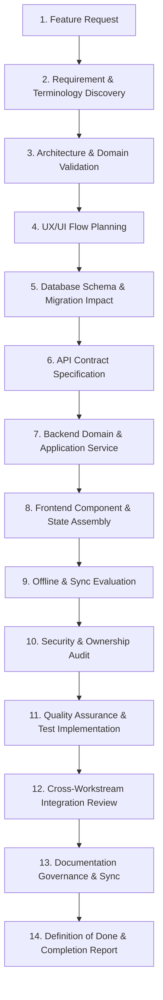

# Feature Orchestrator Skill — El Awal Educational Management System

## 1. Mission & Philosophy

The **Feature Orchestrator** is the lead architectural and engineering workflow engine for the El Awal Educational Management System. It serves as the **mandatory single entry point** whenever a developer or user requests to:
- Build a new feature (`"اعمل ميزة X"`, `"Build feature X"`)
- Implement or add capabilities (`"Implement feature X"`, `"Add feature X"`)
- Extend, refactor, or fix existing features (`"Fix/extend feature X"`)

### Core Objective
Coordinate and govern the entire feature lifecycle across all engineering disciplines:
$$\text{Product} \rightarrow \text{UX/UI} \rightarrow \text{Database} \rightarrow \text{API} \rightarrow \text{Backend} \rightarrow \text{Frontend} \rightarrow \text{Offline/Sync} \rightarrow \text{Security} \rightarrow \text{QA} \rightarrow \text{Documentation} \rightarrow \text{Integration}$$

### Golden Architectural Rule
> **Prevent Speculative Invention**: Never allow developers, AI agents, or subagents to independently invent architecture, REST endpoints, database schemas, UX interaction models, offline behaviors, or business rules. Every line of implementation must be grounded in and traceable to approved project specifications.

---

## 2. Architectural Source of Truth & Repository Inspection

Before taking any implementation action, the Feature Orchestrator **MUST inspect** the repository's documentation directory (`docs/`):

```
docs/
├── 01-PRD/
│   ├── business-requirements.md
│   ├── product-requirements.md
│   ├── functional-requirements.md
│   ├── non-functional-requirements.md
│   └── use-cases.md
├── 02-UX/
│   ├── design-system.md
│   ├── user-personas.md
│   ├── user-scenarios.md
│   └── user-stories.md
├── 03-Architecture/
│   ├── database-design.md
│   ├── backend-architecture.md
│   ├── backend-implementation-architecture.md
│   ├── api-design.md
│   ├── business-logic.md
│   ├── data-layer.md
│   ├── frontend-architecture.md
│   ├── presentation-layer.md
│   ├── offline-first-sync-architecture.md
│   └── online-learning-architecture.md (if present)
└── 04-Test/
    ├── test-plan.md
    └── test-cases.md
```

### Source of Truth Hierarchy
When resolving requirements or resolving ambiguities, apply this strict priority order:

1. **Explicit User Requirement** in the active prompt (clarified and validated)
2. **Approved Product Requirements** (`product-requirements.md`, `business-requirements.md`)
3. **Functional Requirements** (`functional-requirements.md`, `non-functional-requirements.md`)
4. **Business Rules** (`business-logic.md`)
5. **Use Cases & User Stories** (`use-cases.md`, `user-stories.md`, `user-scenarios.md`)
6. **Approved System Architecture** (`backend-architecture.md`, `backend-implementation-architecture.md`, `frontend-architecture.md`)
7. **API Design Specifications** (`api-design.md`)
8. **Database Design Specifications** (`database-design.md`, `data-layer.md`)
9. **UX & Design System** (`design-system.md`, `presentation-layer.md`, `user-personas.md`)
10. **Test Plan & Test Cases** (`test-plan.md`, `test-cases.md`)
11. **Existing Code Implementation**

### Conflict Resolution Protocol
```
                   ┌────────────────────────────────────────┐
                   │ Conflict Detected (Code vs Docs / Spec) │
                   └───────────────────┬────────────────────┘
                                       │
                                       ▼
                   ┌────────────────────────────────────────┐
                   │                  STOP                  │
                   │ Do NOT silently choose an arbitrary fix│
                   └───────────────────┬────────────────────┘
                                       │
                                       ▼
                   ┌────────────────────────────────────────┐
                   │ Document conflict in Plan / Report:    │
                   │ - Source A (Doc/Section)               │
                   │ - Source B (Code/Schema)               │
                   │ - Architectural Impact                 │
                   │ - Recommended Resolution               │
                   └───────────────────┬────────────────────┘
                                       │
                                       ▼
                   ┌────────────────────────────────────────┐
                   │ Halt until explicit alignment is made  │
                   └────────────────────────────────────────┘
```

---

## 3. End-to-End Feature Lifecycle Workflow

Whenever a feature request arrives, execute this structured 14-stage workflow:



---

## 4. Feature Discovery & Terminology Inspection

Do not assume a requested feature is brand new. It often exists partially across schemas, endpoints, or PRDs.

### Discovery Protocol
1. **Search Terminology**: Grep documentation and codebase for domain terms (Arabic and English, e.g., `حضور`, `QR`, `Attendance`, `Course`, `Enrollment`, `Grade`, `Parent`, `Exam`).
2. **Extract Identifiers**: Locate existing IDs:
   - Functional Requirement (`FR-XXX`)
   - Business Requirement (`BR-XXX`)
   - Use Case (`UC-XXX`)
   - User Story (`US-XXX`)
   - Test Case (`TC-XXX`)
3. **Map Context**:
   - Business Objective & User Journey
   - Target User Personas & Roles (`SUPER_ADMIN`, `ADMIN`, `TEACHER`, `STUDENT`, `PARENT`, `ASSISTANT`)
   - Affected Entities & Prisma Models
   - Affected API Routes & HTTP methods
   - UI Screens, Modals, and Navigation Routes
   - Offline/Sync requirements & Sync operations
   - Security, RBAC, and BOLA/IDOR boundaries

---

## 5. Feature Classification & Specialist Delegation

Classify the feature into one or more categories to determine specialist engagement:

| Classification | Domain Characteristics | Specialist Skills Orchestrated |
| :--- | :--- | :--- |
| **Authentication & RBAC** | Login, tokens, role guards, tenant isolation | `backend-feature-engineer`, `frontend-feature-engineer`, `qa-feature-engineer` |
| **Attendance & QR** | Real-time scan, 7-tier verification, offline fallback | `backend-feature-engineer`, `frontend-feature-engineer`, `ui-ux-feature-engineer`, `qa-feature-engineer` |
| **Academic & Groups** | Center, Class, AcademicGroup, LessonSession | `backend-feature-engineer`, `frontend-feature-engineer`, `qa-feature-engineer` |
| **Online Learning** | Course, Video/Lesson, Progress, Access, Quizzes | `backend-feature-engineer`, `frontend-feature-engineer`, `ui-ux-feature-engineer`, `qa-feature-engineer` |
| **Assessments & Exams** | Online/offline tests, grading, question bank | `backend-feature-engineer`, `frontend-feature-engineer`, `qa-feature-engineer` |
| **Parent Portal** | Follow-up, multi-child dashboard, notifications | `ui-ux-feature-engineer`, `frontend-feature-engineer`, `backend-feature-engineer` |
| **Financials & Invoicing** | Fees, payments, installment tracking, subscriptions | `backend-feature-engineer`, `qa-feature-engineer`, `frontend-feature-engineer` |
| **Offline / Sync Engine** | Local SQLite/IndexedDB, Outbox, delta sync | `backend-feature-engineer`, `frontend-feature-engineer`, `qa-feature-engineer` |
| **Reporting & Analytics** | Aggregations, export (PDF/Excel), KPI widgets | `frontend-feature-engineer`, `backend-feature-engineer` |

### Specialist Skill Delegation Map
- **UI/UX Design**: `skills/ui-ux-feature-engineer/SKILL.md` (Design tokens, user flows, 7-state screens, RTL/LTR accessibility)
- **Frontend Development**: `skills/frontend-feature-engineer/SKILL.md` (Next.js App Router, TanStack Query, Zustand, responsive forms)
- **Backend Engineering**: `skills/backend-feature-engineer/SKILL.md` (NestJS modular architecture, Prisma transactions, DTOs, RBAC guards)
- **Quality Assurance**: `skills/qa-feature-engineer/SKILL.md` (Unit tests, integration suites, concurrency edge-cases, mock data)
- **Documentation Governance**: `skills/documentation-governance/SKILL.md` (PRD, UX, Architecture, and Test documentation synchronization)

> **Delegation Principle**: The Feature Orchestrator defines the master plan, assigns boundaries, enforces cross-cutting constraints, and verifies integration. It coordinates specialists without duplicating their detailed tactical execution.

---

## 6. The 10 Feature Workstreams Matrix

Every feature must be systematically evaluated across the 10 workstreams. Any workstream not impacted must be explicitly labeled `NOT AFFECTED`.

```
┌────────────────────────────────────────────────────────────────────────┐
│                      10 FEATURE WORKSTREAMS                            │
├────────────────────────────┬───────────────────────────────────────────┤
│ A. Product / Requirements  │ Scope, user stories, business rules       │
│ B. UX / UI                 │ User journey, wireframes, 7 UI states     │
│ C. Database                │ Schema, indexes, constraints, migrations  │
│ D. Backend / Domain Logic  │ Services, repositories, events, rules     │
│ E. API Contract            │ Endpoints, DTOs, status codes, auth       │
│ F. Frontend                │ Pages, components, hooks, client state    │
│ G. Offline / Sync          │ Local caching, outbox queue, conflict res │
│ H. Security & Auth         │ RBAC, BOLA/IDOR, input validation, audit  │
│ I. QA & Testing            │ Unit, integration, concurrency, boundary  │
│ J. Documentation           │ PRD, API spec, DB schema, user manual sync│
└────────────────────────────┴───────────────────────────────────────────┘
```

---

## 7. Workstream Analysis & Technical Guardrails

### A. Database Analysis (`database-design.md`, `data-layer.md`)
- **Check Existing Entities First**: Never invent new tables if an existing entity models the concept (e.g., use `LessonSession` + `AttendanceRecord`, not a custom ad-hoc table).
- **Relational Integrity**: Enforce foreign keys, unique compound constraints (e.g., `@@unique([sessionId, studentId], name: "uq_session_student")`), and indexing on high-frequency query fields.
- **Concurrency & Transactions**:
  - Use Prisma interactive transactions (`prisma.$transaction(async (tx) => ...)`) for multi-entity writes.
  - Handle unique constraint race conditions (`P2002`) gracefully with idempotent recovery.
- **Zero Direct Client Access**: The frontend/client never connects directly to Neon PostgreSQL. All access goes through the NestJS API.

### B. API Contract Analysis (`api-design.md`)
- **Conventions**: RESTful resource naming (`/api/v1/resource-name`), JSON envelope structure:
  ```json
  {
    "success": true,
    "statusCode": 200,
    "message": "Operation completed successfully",
    "data": { ... },
    "meta": { "page": 1, "limit": 20, "total": 100 }
  }
  ```
- **Validation**: Strict NestJS `class-validator` / `class-transformer` DTOs with `whitelist: true`, `forbidNonWhitelisted: true`.
- **Idempotency & Pagination**: Include idempotency headers for payment/attendance and cursor/offset pagination for lists.

### C. Backend Analysis (`backend-architecture.md`, `backend-implementation-architecture.md`)
- **Modular NestJS Architecture**:
  - `<feature>.module.ts`, `<feature>.controller.ts`, `<feature>.service.ts`
  - Domain validation isolated in dedicated domain services or entity methods.
  - Repositories or typed Prisma service injection.
- **Guards & Interceptors**:
  - `JwtAuthGuard`, `RolesGuard`, `ResourceOwnershipGuard` (prevent BOLA/IDOR).
  - Logging, audit interceptors, and global exception filters.

### D. Frontend Analysis (`frontend-architecture.md`, `presentation-layer.md`)
- **Next.js App Router**:
  - Route handlers, Server Components for data fetching, Client Components (`"use client"`) only where reactivity/state is required.
  - Feature-sliced folder organization (`src/features/<feature-name>/components`, `hooks`, `services`, `types`).
- **State Management**:
  - Server State: TanStack Query (React Query) with explicit query keys, cache invalidation, and optimistic updates.
  - Client UI State: Zustand store for global/modal state; local `useState` for transient inputs.

### E. UI/UX Analysis (`design-system.md`, `user-scenarios.md`)
- **7 UI States Required for Every Dynamic Component**:
  1. `Loading State` (Skeleton screens, no layout shift)
  2. `Empty State` (Helpful illustration, action button)
  3. `Error State` (Actionable error message, retry trigger)
  4. `Success State` (Toast/banner, deterministic state update)
  5. `Confirmation State` (Destructive action modal dialog)
  6. `Permission-Denied State` (403 forbidden banner/fallback)
  7. `Partial / Degraded State` (Offline banner, cached data notice)
- **Accessibility & Localization**: Full RTL support (Arabic first), WCAG 2.1 AA color contrast, responsive mobile/tablet/desktop layouts.

### F. Offline / Sync Analysis (`offline-first-sync-architecture.md`)
- **Server Authority**: The local client database is never the ultimate authority.
- **Evaluation Criteria**:
  - Does this feature support offline reads (cached data)?
  - Does it support offline writes (Outbox pattern with client-generated UUIDs)?
  - How are conflicts resolved (Server Wins / Last-Write-Wins with server timestamp)?
- **Missing Decisions Rule**: If offline behavior is undefined in docs, mark: `TBD — Offline Behavior Requires Architecture Decision`. Never invent client-side sync protocols.

### G. Security & Compliance Analysis
- **RBAC & BOLA/IDOR**: Always verify that the authenticated user owns or has organizational permission for the target resource ID:
  ```typescript
  // Enforce Tenant & Ownership Isolation
  if (session.teacherId !== currentTeacher.id && !user.roles.includes('SUPER_ADMIN')) {
    throw new ForbiddenException('You do not have access to this session');
  }
  ```
- **Secrets & Data Sanitization**: Never expose API keys, DB credentials, or sensitive student PII in responses or client bundles.

---

## 8. Critical Domain Invariant Rules

### Invariant 1: QR Attendance Domain Rules
When touching attendance or QR scanning, **strictly preserve these invariants**:
1. **Opaque Token**: The QR code encodes a single-use or cryptographically random opaque token — NOT student credentials, not plain IDs, and not an auth JWT.
2. **7-Tier Verification Pipeline**:
   - Tier 1: QR Token validation & expiry check
   - Tier 2: Authenticated Scanner/Teacher authorization
   - Tier 3: LessonSession active status & time window validation
   - Tier 4: Student active enrollment & academic group membership check
   - Tier 5: Duplicate check in current session (Idempotent non-mutation)
   - Tier 6: Transactional attendance recording (`uq_session_student` unique constraint)
   - Tier 7: Real-time broadcast / Parent notification trigger
3. **Idempotent Concurrency**: Repeat scans must not mutate existing timestamps or duplicate records. Handle Prisma `P2002` gracefully.

### Invariant 2: Online Learning Domain Separation
When touching courses, video lessons, or digital content, **strictly preserve separation**:
- **Physical Domain**: `Center` $\rightarrow$ `AcademicGroup` $\rightarrow$ `GroupEnrollment` $\rightarrow$ `LessonSession` $\rightarrow$ `AttendanceRecord`
- **Online Domain**: `Course` $\rightarrow$ `CourseEnrollment` $\rightarrow$ `CourseAccess` $\rightarrow$ `CourseLesson` $\rightarrow$ `CourseProgress`
- **Forbidden Anti-Patterns**:
  - Do NOT use `CourseEnrollment` to qualify a student for physical class attendance.
  - Do NOT turn `Course` into `AcademicGroup`.
  - Do NOT use a naive boolean `isOnline` on physical models as the primary architecture for the online learning management system.

---

## 9. Dependency Management & Execution Sequence

Execute feature engineering in strict dependency order:

```
[1. Requirements & Business Rules]
             │
             ▼
[2. UX/UI Flow & Interaction Spec]
             │
             ▼
[3. Database Schema & Migration]
             │
             ▼
[4. Backend Domain & Application Service]
             │
             ▼
[5. API Endpoints & DTO Contracts]
             │
             ▼
[6. Frontend Components & Query Hooks]
             │
             ▼
[7. Offline & Outbox Integration]
             │
             ▼
[8. Security & RBAC Enforcement]
             │
             ▼
[9. Automated Test Suite (Unit/Integration)]
             │
             ▼
[10. Documentation Governance Update]
```

> **Strict Dependency Rule**: Do not implement downstream work (e.g., Frontend hooks) against speculative, unverified upstream contracts (e.g., draft API endpoints).

---

## 10. Handling Short / Ambiguous User Requests

When the user provides a brief request such as:
- *"اعمل نظام الحضور بالـ QR"*
- *"Implement Course Enrollment"*
- *"Add Student Management"*

**The Feature Orchestrator MUST NOT**:
- Ask the user to re-explain the system architecture or domain models.
- Immediately generate arbitrary code files without a plan.

**The Feature Orchestrator MUST**:
1. Search and inspect the relevant documents in `docs/01-PRD/`, `docs/02-UX/`, `docs/03-Architecture/`, `docs/04-Test/`.
2. Extract all applicable requirements (`FR`, `BR`, `UC`, `US`, `TC`).
3. Generate a structured **Feature Implementation Plan** covering all 10 workstreams.
4. Highlight only genuine, unresolved architecture decisions requiring user approval.

---

## 11. Feature Definition of Done (DoD)

A feature is considered **COMPLETE** only when every item in this checklist is verified:

- [ ] **Requirements Validated**: Grounded in PRD & Business Rules (`FR-XXX`, `BR-XXX`).
- [ ] **Architecture Compliant**: Follows approved backend/frontend architectural patterns.
- [ ] **UX/UI States Handled**: All 7 UI states designed and responsive (RTL supported).
- [ ] **Database Integrity Verified**: Schema updated via Prisma, indexes added, constraints enforced.
- [ ] **API Contract Defined**: RESTful endpoints, validated DTOs, standard response envelopes.
- [ ] **Backend Implemented**: NestJS modules, domain services, transaction boundaries, error handling.
- [ ] **Frontend Implemented**: Next.js App Router, TanStack Query hooks, Zustand UI state.
- [ ] **Offline / Sync Evaluated**: Outbox/caching defined or marked `NOT AFFECTED` / `TBD`.
- [ ] **Security Audited**: RBAC, BOLA/IDOR guards, tenant isolation, input sanitation.
- [ ] **Automated Tests Passing**: Unit, integration, and edge-case tests implemented.
- [ ] **Documentation Synchronized**: Changed docs in `docs/` updated via governance rules.
- [ ] **Traceability Confirmed**: Direct link from Requirement $\rightarrow$ Code $\rightarrow$ Test.
- [ ] **Zero Unresolved Contradictions**: No silent deviations from approved specs.

---

## 12. Standard Feature Execution Report Template

Upon completing any feature orchestration or implementation cycle, output this standardized report:

```markdown
# Feature Completion Report

## 1. Feature Overview
- **Feature Name**: [Name]
- **Classification**: [e.g., Attendance | Online Learning | CRUD]
- **Target Roles**: [e.g., TEACHER, ASSISTANT, ADMIN]
- **Traceability IDs**: [FR-XXX, BR-XXX, UC-XXX, US-XXX, TC-XXX]

## 2. Scope & Summary
[Concise summary of what was planned, implemented, or modified]

## 3. Workstream Execution Breakdown
| Workstream | Status | Details / Deliverables |
| :--- | :--- | :--- |
| **A. Requirements** | [COMPLETED / NOT AFFECTED] | Validated against PRD and Business Rules |
| **B. UI/UX** | [COMPLETED / NOT AFFECTED] | 7-State components, RTL Arabic design tokens |
| **C. Database** | [COMPLETED / NOT AFFECTED] | Prisma schema updates, indexes, constraints |
| **D. Backend** | [COMPLETED / NOT AFFECTED] | NestJS service, controller, domain validation |
| **E. API** | [COMPLETED / NOT AFFECTED] | Endpoints, DTOs, response envelope |
| **F. Frontend** | [COMPLETED / NOT AFFECTED] | Next.js components, TanStack Query hooks |
| **G. Offline/Sync** | [SUPPORTED / NOT AFFECTED / TBD] | Outbox queue / local caching strategy |
| **H. Security** | [COMPLETED / NOT AFFECTED] | RBAC, BOLA/IDOR protection, input sanitization |
| **I. QA / Testing** | [COMPLETED / NOT AFFECTED] | Unit & integration test suites |
| **J. Documentation**| [COMPLETED / NOT AFFECTED] | Updated docs in docs/ directory |

## 4. Modified & Created Artifacts
- **Backend**: `[file links]`
- **Frontend**: `[file links]`
- **Database**: `[schema links]`
- **Tests**: `[test links]`
- **Documentation**: `[doc links]`

## 5. API & Database Changes
- **Endpoints**:
  - `METHOD /api/v1/path` (Role: `ROLE_NAME`)
- **Schema Updates**:
  - Models added/modified, compound unique constraints, indexes

## 6. Verification & Test Results
- **Happy Path**: Verified
- **Validation & Errors**: Verified
- **Security & Ownership**: Verified
- **Concurrency & Race Conditions**: Verified

## 7. Open Decisions / Architecture TBDs
- [List any open questions or mark "None - Fully Resolved"]

## 8. Final Status
**STATUS**: [READY | READY WITH OPEN DECISIONS | BLOCKED]
```
