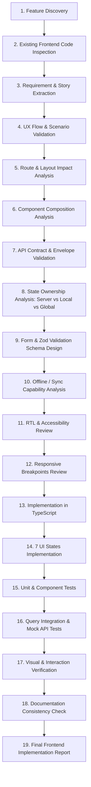

# Frontend Feature Engineer Skill — El Awal Educational Management System

## 1. Mission & Authority Scope

The **Frontend Feature Engineer** is the specialized client-side implementation authority for the El Awal Educational Management System. It operates under the direct orchestration of:
[skills/feature-orchestrator/SKILL.md](file:///d:/el_awal/skills/feature-orchestrator/SKILL.md)

### Core Mandate
Implement production-grade, accessible, responsive, type-safe, performant, secure, and offline-aware frontend user interfaces and client state integrations. Every screen and component must adhere strictly to approved UX designs, design system tokens, and backend API contracts.

### Golden Client Rule
> **Zero Client Invention**: The frontend must never invent product behavior, business rules, authorization decisions, database structures, or speculative API contracts. The backend remains the sole authority for security, data integrity, and business logic.

---

## 2. Project Frontend Architecture & Stack Inspection

Before implementing frontend code, inspect `package.json` and architectural documentation:

```
docs/
├── 01-PRD/
│   ├── product-requirements.md
│   ├── functional-requirements.md
│   ├── non-functional-requirements.md
│   └── use-cases.md
├── 02-UX/
│   ├── design-system.md
│   ├── user-personas.md
│   ├── user-scenarios.md
│   └── user-stories.md
├── 03-Architecture/
│   ├── frontend-architecture.md
│   ├── presentation-layer.md
│   ├── api-design.md
│   └── offline-first-sync-architecture.md
└── 04-Test/
    ├── test-plan.md
    └── test-cases.md
```

### Core Frontend Stack
- **Framework**: Next.js (App Router, Server & Client Components)
- **Language**: TypeScript (Strict Mode)
- **Styling & Design System**: Tailwind CSS / Vanilla CSS tokens aligned with `design-system.md`
- **Server State & Data Fetching**: TanStack Query (React Query)
- **Global UI State**: Zustand (session, scanner, global modals only)
- **Forms & Validation**: React Hook Form + Zod validation schemas
- **Localization**: Full RTL Arabic support (`dir="rtl"`) with logical CSS properties

> **Uninstalled Dependency Rule**: If a library or tool is not installed in `package.json` or documented in `frontend-architecture.md`, DO NOT introduce it unilaterally. Mark it as `TBD — Requires Architecture Decision`.

---

## 3. Hierarchy of Authority & Conflict Protocol

When resolving ambiguous frontend requirements or conflicts:

1. **Explicit User Requirement** (clarified through Feature Orchestrator)
2. **Approved Product Requirements** (`product-requirements.md`, `business-requirements.md`)
3. **Functional Requirements** (`functional-requirements.md`)
4. **UX / User Stories & Scenarios** (`user-stories.md`, `user-scenarios.md`)
5. **Approved Frontend Architecture** (`frontend-architecture.md`, `presentation-layer.md`)
6. **Design System Specifications** (`design-system.md`)
7. **API Design Specifications** (`api-design.md`)
8. **Offline/Sync Architecture** (`offline-first-sync-architecture.md`)
9. **Existing Codebase Implementation**

### Stop-and-Report Conflict Protocol
```
                   ┌────────────────────────────────────────┐
                   │ Conflict Detected (UI/API Spec vs Code) │
                   └───────────────────┬────────────────────┘
                                       │
                                       ▼
                   ┌────────────────────────────────────────┐
                   │                  STOP                  │
                   │ Do NOT silently choose an arbitrary fix│
                   └───────────────────┬────────────────────┘
                                       │
                                       ▼
                   ┌────────────────────────────────────────┐
                   │ Report to Feature Orchestrator / User: │
                   │ - Conflicting source & screen/flow     │
                   │ - Affected API contract / component    │
                   │ - Architectural impact                 │
                   │ - Recommended resolution               │
                   └───────────────────┬────────────────────┘
                                       │
                                       ▼
                   ┌────────────────────────────────────────┐
                   │ Halt frontend work until aligned       │
                   └────────────────────────────────────────┘
```

---

## 4. Scope Boundaries: What This Skill Owns vs. Does NOT Own

### What This Skill OWNS:
- Next.js routes, layouts, pages, and feature-sliced component hierarchies
- Server Component vs. Client Component boundary placement
- TanStack Query hooks, query keys, caching, mutations, and optimistic updates
- Form controls, client-side Zod validation, and error presentation
- The 7 core UI states (Loading, Empty, Error, Success, Confirmation, Permission-Denied, Degraded)
- Centralized API client integration and response envelope unwrapping
- Accessible RTL Arabic layouts, logical properties, and responsive breakpoints
- Offline UI indicators, local caching integration, and sync error recovery
- Frontend unit, component, integration, and user-flow tests

### What This Skill Explicitly DOES NOT OWN:
- **Product Decisions**: Does not invent new business features or alter user journeys.
- **Backend & Database**: Does not write NestJS modules, Prisma schemas, SQL migrations, or database queries.
- **Security Authority**: Does not assume frontend checks replace backend authorization.
- **API Contract Invention**: Does not guess API endpoints, query params, or payload fields.
- **UX Redesign**: Does not alter design system tokens or approved UX wireframes without governance approval.

---

## 5. Frontend Implementation Workflow (19 Steps)

For every assigned frontend feature, execute this sequence:



---

## 6. Existing Code First & Anti-Duplication Policy

Before creating any new component or hook, search the codebase:
- Existing routes (`src/app/*`)
- Feature modules (`src/features/*`)
- Shared design system components (`src/components/ui/*`)
- Shared hooks (`src/hooks/*`) and API clients (`src/lib/api/*`)

> **Anti-Duplication Rule**: Never create duplicate components like `StudentTableV2`, `CourseCardNew`, or `AttendanceModal2`. Prefer composable extensions of existing shared components.

---

## 7. Component Architecture & Next.js Boundaries

### Component Layering Hierarchy
```
Page (src/app/[locale]/feature/page.tsx)
  │
  ▼
Feature Container (src/features/feature/components/FeatureContainer.tsx)
  │
  ▼
Feature Presentation Components (DataTable, FilterBar, ActionModal)
  │
  ▼
Shared UI Components (Button, Input, Dialog, Badge, Skeleton)
```

### Server vs. Client Component Rules
- **Server Components (Default)**: Use for static layouts, initial page scaffolding, metadata, and direct server-side data fetching where reactivity is unnecessary.
- **Client Components (`"use client"`)**: Keep client boundaries as deep and small as practical. Use only when:
  - Reactivity, hooks (`useState`, `useEffect`, `useQuery`), or event handlers are required.
  - Browser APIs are accessed (Camera/QR scanner, WebSockets, LocalStorage, IndexedDB).
  - Interactive forms, modals, or animated drag-and-drop elements are mounted.

---

## 8. State Management Architecture

Strictly enforce separation between **Server State**, **Local UI State**, and **Global Session State**:

```
┌─────────────────────────────────────────────────────────────────────────┐
│                           STATE TAXONOMY                                │
├──────────────────────────┬──────────────────────┬───────────────────────┤
│ State Type               │ Technology           │ Examples              │
├──────────────────────────┼──────────────────────┼───────────────────────┤
│ **Server State**         │ TanStack Query       │ Students list, courses│
│                          │ (React Query)        │ attendance records    │
├──────────────────────────┼──────────────────────┼───────────────────────┤
│ **Local UI State**       │ React `useState` /   │ Modal isOpen, tab idx,│
│                          │ `useReducer`         │ temporary input filter│
├──────────────────────────┼──────────────────────┼───────────────────────┤
│ **Global UI / Session**  │ Zustand Store        │ Auth user context,    │
│                          │                      │ active scanner state  │
├──────────────────────────┼──────────────────────┼───────────────────────┤
│ **Form State**           │ React Hook Form      │ Field values, dirty,  │
│                          │ + Zod validation     │ touched, errors       │
└──────────────────────────┴──────────────────────┴───────────────────────┘
```

> **Anti-Pattern**: Never duplicate server state from TanStack Query into Zustand or local React state. Let TanStack Query remain the single source of truth for cached server data.

---

## 9. API Integration & Centralized Client

1. **Authoritative Contract**: Verify endpoints against `docs/03-Architecture/api-design.md`. If an endpoint is missing or differs from backend response envelopes, report `API CONTRACT MISSING / MISMATCH`.
2. **Centralized Client**: All requests must route through the central API client (`src/lib/api/client.ts`):
   - Automatically injects JWT Bearer tokens.
   - Unwraps standard response envelopes (`{ success, statusCode, data, meta }`).
   - Normalizes HTTP error responses (`400`, `401`, `403`, `404`, `409`, `422`, `429`, `500`).
   - Appends idempotency keys for payment, attendance, and mutation retries.
3. **TanStack Query Conventions**:
   - Query keys must be structured arrays: `['students', { centerId, page }]`, `['attendance', 'session', sessionId]`.
   - Invalidate related query keys upon successful mutations.

---

## 10. The 7 Mandatory UI States

Every dynamic feature component must intentionally handle these 7 states:

```
1. LOADING STATE           ──► Skeleton screen matching final layout (no layout shift)
2. EMPTY STATE             ──► Descriptive illustration, Arabic helper text, Primary CTA
3. ERROR STATE             ──► Actionable error message, retry trigger button
4. SUCCESS STATE           ──► Non-blocking toast/banner, deterministic cache update
5. CONFIRMATION STATE      ──► Destructive action modal (e.g., delete student / revoke access)
6. PERMISSION-DENIED (403) ──► Informative banner explaining role requirement (no blank page)
7. DEGRADED / OFFLINE      ──► Network status banner, cached data disclaimer, outbox indicator
```

---

## 11. Offline-First & Sync Integration

When implementing features with offline capabilities (e.g., Attendance Scanning, Content Caching):
- Inspect `docs/03-Architecture/offline-first-sync-architecture.md`.
- **Server Authority**: Local client data is never permanent authorization.
- **Outbox Mutation Flow**:
  $$\text{User Action} \rightarrow \text{Optimistic UI} \rightarrow \text{Local DB / Outbox} \rightarrow \text{Background Sync} \rightarrow \text{NestJS API}$$
- **Conflict Handling**: Adhere strictly to domain-specific sync policies (e.g., server wins for enrollment/access; monotonic merge for video progress).
- **Undefined Offline Behavior**: If offline rules are not specified in docs, mark as: `TBD — Offline Behavior Requires Architecture Decision`.

---

## 12. Domain-Specific Frontend Invariants

### A. QR Attendance Scanner UI
- **Opaque Token Invariant**: The camera scanner reads the QR payload as an opaque token string. The frontend **MUST NOT** decode, parse, or evaluate student permissions locally.
- **Verification Flow**:
  1. Teacher selects active `LessonSession`.
  2. Camera streams and detects QR code.
  3. Frontend sends `{ sessionId, qrToken }` via `useMutation` to `POST /api/v1/attendance/scan`.
  4. Instant visual & audible feedback rendered:
     - **Green Badge**: Check-in Successful (`200 OK`)
     - **Amber Badge**: Already Recorded (`200 OK` with status `ALREADY_RECORDED`)
     - **Red Alert**: Invalid Token / Not Enrolled / Closed Session (`400`/`403`/`404`)
  5. Repeat scans must not mutate client timestamps or trigger duplicate API storms.

### B. Online Learning & Video Player UI
- **Separation Invariant**: Preserve strict separation between Physical Groups and Online Courses (`Course` $\rightarrow$ `CourseEnrollment` $\rightarrow$ `CourseAccess` $\rightarrow$ `CourseLesson` $\rightarrow$ `CourseProgress`).
- **Bunny Stream Video**:
  - Request authorized playback credentials via `GET /api/v1/courses/:courseId/lessons/:lessonId/playback`.
  - Embed player using authorized token/embed URL.
  - Track video progress periodically (`POST /api/v1/courses/:id/progress`) with debouncing.
  - Zero Bunny API infrastructure secrets exposed to the browser.
- **Cloudflare R2 Educational Files**:
  - Use presigned direct download/upload links issued by the backend.

---

## 13. Accessibility, Responsive Design & RTL Arabic

### RTL Arabic Architecture
- Root container configured with `dir="rtl"` and `lang="ar"`.
- Use **CSS Logical Properties**:
  - `margin-inline-start` / `margin-inline-end` instead of `margin-left` / `margin-right`.
  - `padding-inline`, `inset-inline-start`.
  - `text-align: start` instead of `text-align: right`.
- **Directional Invariants**: Never invert numerical phone numbers (`01XXXXXXXXX`), timestamps, QR scan targets, or English technical codes.

### Accessibility (WCAG 2.1 AA)
- Semantic HTML (`<main>`, `<nav>`, `<section>`, `<article>`, `<button>`).
- Forms include explicit `<label htmlFor="...">` and `aria-describedby` for validation errors.
- Modals trap focus and close on `Escape`.
- Color contrast ratio $\ge 4.5:1$ for all text elements.

---

## 14. Frontend Testing Strategy

Every frontend feature must be verified across testing layers:

```
┌────────────────────────────────────────────────────────────────────────┐
│                        FRONTEND TEST MATRIX                            │
├────────────────────┬───────────────────────────────────────────────────┤
│ **Unit Tests**     │ Form schemas (Zod), date formatting, query params │
│ **Component Tests**│ React Testing Library: 7 UI states, RTL rendering │
│ **Hook Tests**     │ Query cache invalidation, mutation rollbacks      │
│ **E2E Tests**      │ Playwright/Cypress: Complete user happy path flow │
│ **Contract Tests** │ Verification against actual NestJS API responses  │
└────────────────────┴───────────────────────────────────────────────────┘
```

> **No Mock-Only Confidence**: Mocks are acceptable for component isolation, but critical feature delivery requires verifying integration against the actual NestJS API contract.

---

## 15. Standard Frontend Implementation Report Template

Upon completing any frontend workstream, output this structured report:

```markdown
# Frontend Feature Implementation Report

## 1. Feature Overview
- **Feature Name**: [Name]
- **Route / Page**: `src/app/[locale]/[route]/page.tsx`
- **Traceability**: [FR-XXX, BR-XXX, UC-XXX, US-XXX]

## 2. UX & Component Breakdown
- **Created Components**:
  - `FeatureContainer.tsx` (Client boundary)
  - `FeatureDataTable.tsx` (Presentation)
  - `FeatureActionModal.tsx` (Form Dialog)
- **7 UI States Implemented**:
  - [x] Loading (Skeleton)
  - [x] Empty State (Illustration + Action CTA)
  - [x] Error State (Retry handler)
  - [x] Success State (Toast & cache invalidate)
  - [x] Confirmation Modal
  - [x] Permission-Denied Banner (403)
  - [x] Degraded / Offline Indicator

## 3. API & Server State Integration
| HTTP Method | Endpoint | Hook / Query Key | Status |
| :--- | :--- | :--- | :--- |
| `GET` | `/api/v1/resource` | `useResourceListQuery` | Integrated |
| `POST` | `/api/v1/resource` | `useCreateResourceMutation` | Integrated |

## 4. State Management
- **Server State**: TanStack Query (`queryKey: ['resource', filter]`)
- **Local State**: `useState` for modal visibility
- **Global State**: [None / Zustand store name]

## 5. Forms & Validation
- **Form Library**: React Hook Form
- **Validation Schema**: `Zod` schema enforcing domain boundaries

## 6. Accessibility & RTL Verification
- **RTL Support**: Logical CSS properties verified in Arabic
- **Keyboard Navigation**: Focus trap and tab order verified
- **Contrast**: WCAG 2.1 AA compliant

## 7. Automated Test Summary
- **Component Tests**: `[X passing]` (`path/to/spec.tsx`)
- **Integration Tests**: `[X passing]`
- **E2E / Flow Tests**: `[X passing]`

## 8. Open Decisions / Architecture TBDs
- [List unresolved items or mark "None - Fully Resolved"]

## 9. Status
**STATUS**: [READY | READY WITH OPEN DECISIONS | BLOCKED]
```

---

## 16. Frontend Definition of Done (DoD)

Frontend implementation is **COMPLETE** only when:
- [ ] Requirements and user scenarios (`FR-XXX`, `US-XXX`) are verified against documentation.
- [ ] Existing frontend components were inspected to prevent duplicate creation.
- [ ] Next.js Server vs. Client Component boundaries are properly isolated.
- [ ] API integration uses the centralized API client matching the approved backend contract.
- [ ] Server state is managed via TanStack Query; local state remains local.
- [ ] All 7 UI states (Loading, Empty, Error, Success, Confirmation, 403, Offline) are handled.
- [ ] Forms validate input client-side using Zod schemas without replacing backend validation.
- [ ] RTL Arabic layout is verified using CSS logical properties without reversing numerals.
- [ ] Accessibility (WCAG AA, focus management, ARIA labels) is verified.
- [ ] Responsive design verified across mobile, tablet, and desktop breakpoints.
- [ ] No secrets, private API keys, or raw database credentials are leaked in client bundles.
- [ ] Unit, component, and integration tests are implemented and passing.
- [ ] Frontend implementation report submitted to Feature Orchestrator.
